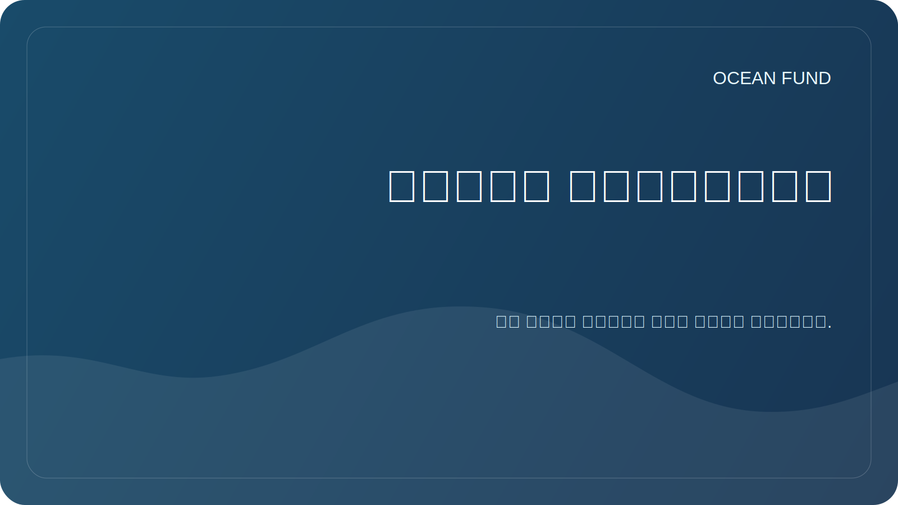

# مصادر البيانات

تستكشف مؤسسة Ocean Foundation مصادر البيانات المفتوحة التي يمكن أن تكون مفيدة للبحث والتعليم والتصور والمشاريع المجتمعية.

## الاتجاهات ذات الأولوية

| مصدر | القيمة المحتملة | ما يجب التحقق منه |
| --- | --- | --- |
| كوبرنيكوس البحرية | البيانات والنماذج والرصد الأوقيانوغرافية | التراخيص وواجهة برمجة التطبيقات (API) والتغطية المكانية والزمانية |
| أوبيس | بيانات التنوع البيولوجي البحري | التصنيف، جودة المشاركة، الاستشهادات |
| جيبكو | شبكات قياس الأعماق والتضاريس السفلية | إذن وقيود الاستخدام |
| EMODnet | البيانات البحرية الأوروبية في عدة مواضيع | إمكانية الوصول والبيانات الوصفية والمعايير |
| نوا / دائرة الرقابة الداخلية | الملاحظات والعوامات والطقس وبيانات المحيطات | واجهة برمجة التطبيقات (API) وقابلية التحديث والإقليمية |
| فهم نت | الصور المشروحة تحت الماء | التراخيص وجودة الملصقات وإمكانية تطبيق تعلم الآلة |
| عقد المحيط | البرامج والمشاريع وأطر التعاون | حالة المبادرات وفرص المشاركة |
| بيانات الأقمار الصناعية وقياس الأعماق | درجة حرارة السطح، الكلوروفيل، الجليد، الأعماق | المصادر والمعالجة والأخطاء |

## الحد الأدنى من بطاقة المصدر

- اسم؛
- منظمة المشغل
- وصلة؛
- نوع البيانات؛
- التغطية الجغرافية؛
- التغطية المؤقتة؛
- رخصة؛
- طريقة الوصول
- مثال على تطبيق البحث؛
- الشيكات التاريخ.

يوجد سجل عمل مفصل في [`datasets-register.md`](../../data/datasets-register.md).
