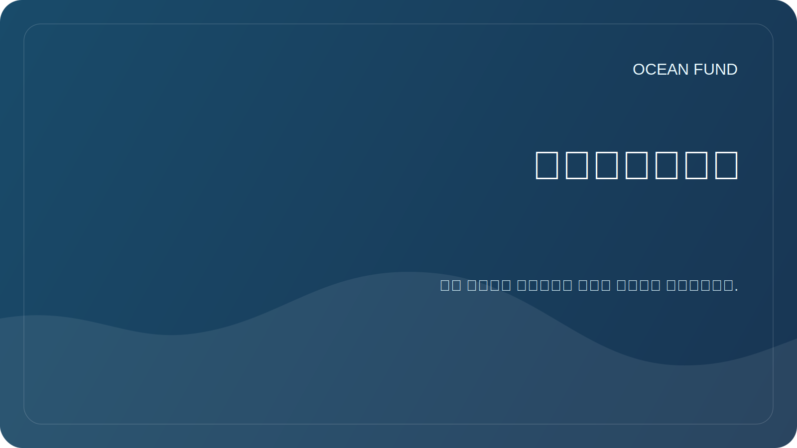

# الأحداث

ويساعد القسم في إعداد مشاركة المؤسسة في المؤتمرات والمعارض وبرامج المتاحف والمناقشات العامة.

## صيغ المشاركة

| شكل | ما هو مناسب ل؟ |
| --- | --- |
| تقرير | تقديم المهمة واتجاهات البحث والبيانات المفتوحة |
| حلقة نقاش | ناقش المحيطات والمناخ والبيانات والتعليم والشراكات بين القطاعات |
| يقف | عرض خرائط البيانات والمرئيات والمواد التعليمية |
| ورشة عمل | استكشاف بشكل تعاوني مصدر بيانات أو سؤال بحثي |
| اجتماع الشراكة | الاتفاق على الأنشطة المشتركة المستقبلية |

## بطاقة الحدث

عند إضافة حدث، حدد:

- اسم؛
- المدينة/البلد أو عبر الإنترنت؛
- بلح؛
- منظم؛
- موضوع؛
- وصلة؛
- الموعد النهائي لتقديم الطلبات؛
- الشكل المحتمل لمشاركة الصندوق؛
- الحالة: `watching`، `applying`، `submitted`، `accepted`، `declined`، `completed`.

## المهام القادمة

- قم بتجميع قائمة بأحداث التواصل المتعلقة بالمحيطات والمناخ والعلوم.
- إعداد تطبيق عالمي للمؤتمر.
- إنشاء عرض تقديمي قصير للصندوق.

## التحف العامة ذات الصلة

- [`conference-exhibition-one-pager.md`](../../public/ar/conference-exhibition-one-pager.md)
- [`event-application-pack.md`](../../public/ar/event-application-pack.md)
- [`indexes-and-publications-one-pager.md`](../../public/ar/indexes-and-publications-one-pager.md)
