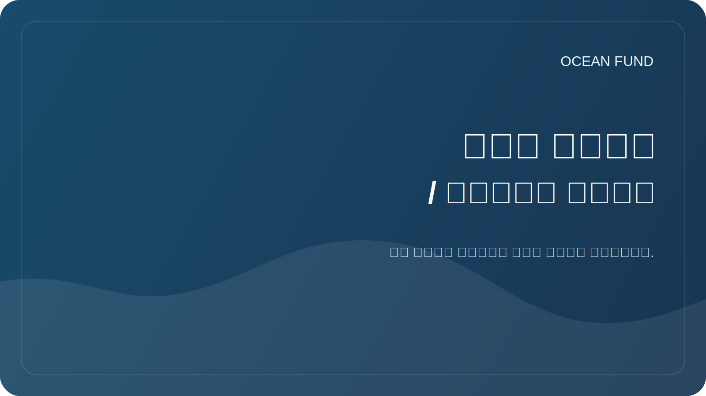

# عرض جيثب / تصميم جيثب

هذه الوثيقة ضرورية لكي يظهر صندوق المحيط على GitHub كمبادرة حية وواضحة وجادة، وليس كمجموعة من المسودات الداخلية.

## ما هو ما

### 1. الملف الشخصي على جيثب

هذه صفحة مستخدم أو مؤسسة. هذا هو المكان الذي يقوم فيه الأشخاص أولاً بتقييم هويتك، وماذا تفعل، وما إذا كانت تستحق المزيد من القراءة.

تحتاج إلى ملء:

- الاسم: `Ocean Fund` أو الاسم الرسمي المعتمد؛
- وصف قصير في جملة واحدة؛
- الصورة الرمزية أو الشعار؛
- موقع؛
- موقع إلكتروني؛
- الروابط الاجتماعية؛
- المستودعات المثبتة.

### 2. الصفحة الرئيسية للمستودع

هذا هو `README.md` في جذر المشروع. ويجب أن يجيب على أربعة أسئلة:

- ما هذا؛
- لماذا هو موجود؟
- ما هو موجود بالفعل؛
- حيث انقر فوق التالي.

### 3. صفحات GitHub أو واجهة متجر خارجية

هذه صفحة عامة منفصلة لأولئك الذين يعانون بالفعل من ضيق في ملف README العادي. بالنسبة لـ Ocean Fund، يجب أن تكون واجهة متجر الشركة الناشئة موجودة في `public/` أو في موقع خارجي منفصل.

### 4. الطبقة العامة الإلزامية

هناك عنصران مطلوبان لصندوق المحيط، وبدونهما يعتبر العرض العام غير مكتمل:

- صفحة الدخول التي تواجه الشريك؛
- نسخة مهمة عامة معتمدة.

داخل المستودع، هذا يعني أن التنقل الخارجي يجب أن يؤدي إلى ما يلي على الأقل:

- [`partners.md`](../../public/ar/partners.md)
- [`partner-one-pager.md`](../../public/ar/partner-one-pager.md)
- [`mission-copy.md`](../../public/ar/mission-copy.md)

بالنسبة للعمل الذي يواجه الأحداث، يُنصح أيضًا بالبقاء بالقرب من:

- [`conference-exhibition-one-pager.md`](../../public/ar/conference-exhibition-one-pager.md)
- [`event-application-pack.md`](../../public/ar/event-application-pack.md)

## الحد الأدنى المطلوب لإكماله في GitHub

### حساب تعريفي

- الصورة الرمزية مع علامة قابلة للقراءة؛
- سيرة ذاتية قصيرة باللغة الروسية أو الإنجليزية؛
- رابط إلى المستودع الرئيسي؛
- 3-6 مستودعات مثبتة؛
- ملف التعريف README مع المهمة والتوجيهات وطرق المشاركة.

قالب الملف الشخصي: [`github-profile-readme.md`](../../templates/github-profile-readme.md)

### مستودع

- وصف موجز للمستودع؛
- عنوان URL لموقع الويب؛
- المواضيع؛
- صورة المعاينة الاجتماعية؛
- وشملت القضايا والمناقشات.
- التمهيدي الواضح؛
- عرض يواجه الشريك؛
- شريك صفحة واحدة؛
- مؤتمر / معرض من صفحة واحدة؛
- حزمة تطبيق الحدث؛
- نسخة المهمة العامة؛
- القضايا المفتوحة الأولى.

## وصف المستودع الموصى به

النسخة الروسية:

> قاعدة بيانات المؤسسة المفتوحة للمحيطات والمناخ والتنوع البيولوجي والبيانات البحرية والتعليم والشراكات الدولية.

النسخة الانجليزية:

> مركز مشروع مفتوح للمحيطات والمناخ والتنوع البيولوجي والبيانات البحرية والتعليم والذكاء الاصطناعي والشراكات.

## المواضيع الموصى بها

- `ocean`
- `climate`
- `biodiversity`
- `marine-data`
- `open-science`
- `education`
- `ai-for-good`
- `research`
- `nonprofit`
- `ocean-literacy`

## ما يجب إضافته إلى ملفك الشخصي

إذا كان الملف شخصياً:

- مستودع الصندوق الرئيسي؛
- عرض أو موقع المشروع؛
- مستودع يحتوي على البيانات أو دفاتر الملاحظات؛
- مستودع العروض التقديمية أو المواد العامة.

إذا كان ملف تعريف المنظمة:

- المحور العام الرئيسي؛
- مجموعات البيانات أو تسجيل البيانات؛
- الموقع أو الصفحات؛
- أبحاث أو دفاتر ملاحظات؛
- مجموعة أدوات التوعية أو الوسائط؛
- الحوكمة أو الوثائق، إذا تم تقديمها بشكل منفصل.

## ما يجب طرحه في القضايا العامة الأولى

- البحث: اجمع 10 موضوعات ذات أولوية تتعلق بالمحيطات والمناخ.
- البيانات: تصميم 5 مصادر بيانات مفتوحة تم التحقق منها.
- التوعية: إعداد رسالة قصيرة للجامعات والمتاحف.
- العلامة التجارية: الموافقة على التهجئة الإنجليزية للاسم والوصف.
- موقع الويب: قم بإحضار `public/` إلى إصدار عام واحد.
- الحوكمة: تحديد الاتصالات العامة واستراتيجية الترخيص.

راجع أيضًا [docs/60-github-issues.md](60-github-issues.md).

## المعاينة الاجتماعية

بالنسبة لـ GitHub، من المفيد إعداد غلاف منفصل بحجم `1280x640`.

ماذا يجب أن يكون عليه:

- اسم المشروع؛
- بيان المهمة القصير؛
- 2-4 كلمات رئيسية، على سبيل المثال: `Ocean`، `Climate`، `Data`، `Partnerships`.

Черновой исходник: [`github-social-preview.svg`](../../assets/brand/github-social-preview.svg)

## عرض إجراءات الإطلاق

1. انشر المستودع بالرمز `README.md` الحالي.
2. قم بتأكيد الطبقة العامة المطلوبة: `public/partners.md` و`public/mission-copy.md`.
3. املأ الوصف وموقع الويب والموضوعات والمعاينة الاجتماعية في إعدادات المستودع.
4. قم بتشغيل المناقشات إذا كنت تريد الأفكار والمناقشات العامة.
5. أنشئ من 5 إلى 10 أعداد بداية حتى يتمكن الزائرون من رؤية الحركة على الفور.
6. قم بإعداد ملف تعريف README للمستخدم أو المؤسسة.
7. قم بتثبيت المستودع في ملف التعريف الخاص بك.
8. إذا لزم الأمر، قم بتوصيل صفحات GitHub أو موقع منفصل من `public/`.

## تبدو النتيجة الجيدة هكذا

يفتح الشخص GitHub ويفهم على الفور:

- هذه ليست مسودة عشوائية، ولكنها مركز رسمي مفتوح للمشروع؛
- المشروع ما يزال في مرحلة مبكرة، لكنه يعرض البنية والخطة بوضوح وصدق؛
- هنا يمكنك بالفعل المشاركة: البحث والمساعدة في البيانات والترجمات والشراكات والمواد.
