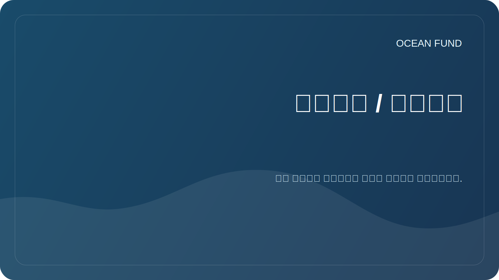

# مسرد / مسرد

يساعد المسرد العملي المشاركين على استخدام المصطلحات الشائعة.

| شرط | معنى |
| --- | --- |
| قياس الأعماق | قياس ووصف تضاريس قاع الخزانات والمحيطات |
| التنوع البيولوجي | تنوع الأنواع والجينات والنظم البيئية |
| الاقتصاد الأزرق | الأنشطة الاقتصادية المتعلقة بالمحيطات والموارد المائية، تخضع لنهج مستدام |
| علم المواطن | المشاركة العامة والتطوعية في جمع البيانات العلمية أو التحقق منها أو تفسيرها |
| البنية التحتية للبيانات | مجموعة من القواعد والأدوات والتنسيقات والعمليات للتعامل مع البيانات بشكل موثوق |
| التلوث البحري | التلوث البحري الناتج عن المواد البلاستيكية والمواد الكيميائية والضوضاء والمنتجات البترولية وغيرها من التأثيرات |
| محو الأمية المحيطية | فهم دور المحيط في حياة الإنسان وتأثير الإنسان على المحيط |
| البيانات المفتوحة | البيانات المتاحة للاستخدام تخضع لقواعد الترخيص والاستشهاد |
| الاستشعار عن بعد | استشعار الأرض عن بعد، بما في ذلك عمليات الرصد عبر الأقمار الصناعية |
| إمكانية تكرار نتائج | إمكانية تكرار تحليل البيانات باستخدام الطريقة الموصوفة |

## قواعد إضافة المصطلحات

يجب أن يكون للمصطلح الجديد تعريف قصير وسياق الاستخدام، وإذا لزم الأمر، رابط للمصدر.
