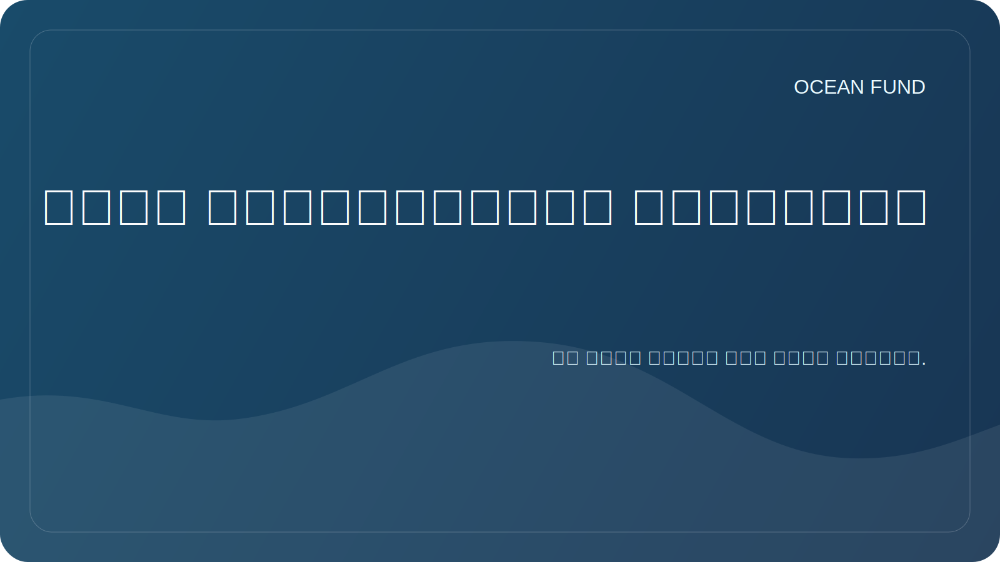

# نظام الاستخبارات المحيطية

وتحدد الوثيقة بروتوكول عمل لاستكشاف موضوع المحيطات بشكل متعمق. لا يشير المحيط إلى بحار الأرض فحسب، بل يشير أيضًا إلى فئة أوسع من "العوالم المحيطية": الأقمار الصناعية الجليدية، والكواكب المائية، وبيئة الفضاء باعتبارها محيطًا للملاحة والبيانات والحياة.

## هدف

بناء نظام بحثي قابل للتكرار يساعد المؤسسة على:

- الدخول بسرعة في مواضيع محيطية جديدة؛
- التمييز بين الحقائق التي تم التحقق منها والفرضيات والبيانات الجميلة ولكن غير المدعومة؛
- العثور على البيانات والشركاء والأحداث والمنح والأحداث العامة؛
- إعداد المواد للموقع الإلكتروني والعروض التقديمية والتطبيقات والمحاضرات ومهام GitHub؛
- ربط محيطات الأرض بمنظور كوني: الاستشعار عن بعد، وعلم الأحياء الفلكي، وعوالم المحيطات، وصلاحية الكواكب للسكن.

## طبقات البحث

| طبقة | ما ندرسه | نوع النتيجة |
| --- | --- | --- |
| علوم | النظم البيئية، المناخ، الكيمياء، قياس الأعماق، علم الأحياء الفلكي | نظرة عامة، المسرد، بطاقة السؤال |
| بيانات | مجموعات البيانات، واجهات برمجة التطبيقات، التراخيص، البيانات الوصفية، الجودة | بطاقة مجموعة البيانات، التسجيل، دفتر الملاحظات |
| التقنيات | الأقمار الصناعية، أجهزة الاستشعار، المنصات المستقلة، التعلم الآلي، التصور | الموجز الفني، النموذج الأولي، المشكلة |
| المؤسسات | الجامعات والمتاحف والمؤسسات وبرامج الأمم المتحدة ووكالات الفضاء | ملخص الشريك، قائمة أدوار جهات الاتصال |
| دعاية | التعليم والمعارض والمحاضرات والبعثات ووسائل الإعلام | السيناريو والعرض والنشر |
| استراتيجية | المخاطر والأخلاق والاستدامة والتمويل | خريطة الطريق، سجل القرار |

## دورة العمل

1. قم بصياغة السؤال: ما الذي يجب فهمه بالضبط ولأي قرار يتخذه الصندوق.
2. ابحث عن المصادر الأولية: بوابات البيانات الرسمية، والبرامج العلمية، والمنشورات، ووثائق API.
3. تقسيم المواد إلى حقائق وتفسيرات وفروض وأفكار.
4. تحقق من تاريخ الوصول والترخيص والقيود وقابلية التطبيق للاستخدام العام.
5. احفظ النتيجة بأحد التنسيقات التالية: المراجعة، بطاقة المصدر، بطاقة مجموعة البيانات، ملخص الشريك، المشكلة، ملخص العرض التقديمي.
6. تحويل النتيجة إلى إجراء: مهمة، رسالة إلى شريك، تصور، تقرير، نموذج أولي، تحديث موقع الويب.

## مستويات العمق

| مستوى | متى تستخدم | ماذا يجب أن يحدث |
| --- | --- | --- |
| استطلاع سريع | موضوع جديد أو طلب شريك | 5-10 مصادر، خريطة المصطلحات، المخاطر |
| مراجعة متعمقة | إحالة التمويل أو المواد العامة | المراجعة المنظمة، المصادر، الثغرات |
| الغوص في البيانات | هل هناك بيانات مفتوحة أو API؟ | بطاقات مجموعة البيانات، مثال الاستعلام، خطة دفتر الملاحظات |
| الموجز الاستراتيجي | نحن بحاجة إلى حل وتطبيق وشراكة | الاستنتاجات وخيارات العمل ومعايير الاختيار |
| الحزمة العامة | المواد تخرج | الصياغات والروابط والقيود التي تم التحقق منها |

## الأتمتة

يجب أن تعمل الأتمتة مثل رادار الأبحاث، وليس مثل تيار من الضوضاء.

الخطوط المنتظمة الموصى بها:

| حلبة | إيقاع | ما يجب تتبعه |
| --- | --- | --- |
| رادار بيانات المحيط | يوميا أو 3 مرات في الأسبوع | كوبرنيكوس مارين، OBIS، GEBCO، EMODnet، NOAA، Argo، NASA Ocean Color |
| رادار عوالم المحيطات | أسبوعي | ناسا، وكالة الفضاء الأوروبية، علم الأحياء الفلكي، يوروبا كليبر، إنسيلادوس، تيتان، قابلية الحياة على الكواكب |
| رادار الشريك | أسبوعي | الجامعات والمتاحف والمؤسسات والمؤتمرات وعقد المحيط |
| المنحة ورادار الحدث | أسبوعي | المنح والدعوات لتقديم المقترحات والمؤتمرات والمعارض |
| نظافة المستودع | أسبوعي | روابط قديمة، أسئلة مفتوحة، مواد ذات الحالة `needs verification` |

تنسيق نتيجة الأتمتة:

- تاريخ وفترة الرصد؛
- مصادر أو تغييرات جديدة؛
- لماذا يعد هذا مهمًا للصندوق؟
- الإجراءات المقترحة؛
- مستوى الثقة؛
- المراجع وتاريخ الوصول؛
- مكان إضافة النتيجة في المستودع.

## مصادر الرادار الأساسية

| مصدر | دور |
| --- | --- |
| مخزن بيانات كوبرنيكوس البحرية | الرصد الفيزيائي والجيوكيميائي الحيوي والجليد للمحيطات |
| أوبيس | بيانات التنوع البيولوجي البحري العالمية |
| جيبكو | قياس الأعماق والنماذج العالمية لإغاثة القاع |
| EMODnet | البيانات البحرية الأوروبية حسب مجال الموضوع |
| نوا / دائرة الرقابة الداخلية | الملاحظات والعوامات والطقس والبيانات الأوقيانوغرافية |
| أرغو | درجة حرارة المحيطات وملامح الملوحة |
| ناسا لون المحيط / PACE | بيانات الأقمار الصناعية عن المحيط والغلاف الجوي ولون المحيط |
| عقد المحيط | الإطار الدولي لعلوم المحيطات والشراكات |
| ناسا عوالم المحيطات / علم الأحياء الفلكي | السياق الكوني للمحيطات والبحث عن الصالحية للسكن |

## كيفية تعليم الدستور الغذائي للعمل في هذا المشروع

من المفيد ضبط كل طلب جديد:

- الموضوع: محيط الأرض، المحيط الكوني أو الجسر بينهما؛
- القطعة الأثرية المرغوبة: المراجعة، الجدول، العرض التقديمي، الإصدار، بطاقة مجموعة البيانات، الرسالة، النموذج الأولي؛
- العمق: الاستطلاع السريع، المراجعة العميقة، الغوص في البيانات، الموجز الاستراتيجي، الحزمة العامة؛
- اللغة: الروسية، الإنجليزية أو ثنائية اللغة؛
- الحالة: مسودة، للقرار الداخلي، مادة معدة للعامة؛
- القيود: المصادر، المنطقة، التاريخ، التنسيق، جمهور الشريك.

إذا لم تكن هناك معلمات، فيجب أن يكون الدستور الغذائي افتراضيًا على النحو التالي:

- البدء بالمصادر الأولية والبيانات الرسمية؛
- ضع خطة قصيرة قبل العمل الكبير؛
- قم بتخزين النتائج التي تم فحصها في `docs/` أو `research/` أو `data/` أو `project-management/`؛
- لا تقدم الشراكات والمنح والنتائج العلمية غير المؤكدة كحقيقة؛
- حدد المكان الذي يلزم فيه فحص الخبراء.

## الحزم البحثية القادمة

| كيس من البلاستيك | معنى | النتيجة الأولى |
| --- | --- | --- |
| خط الأساس المحيطي | جمع الأساس العلمي للصندوق بسرعة | خريطة الاتجاهات و30 مصدرا رئيسيا |
| أطلس البيانات | تحويل مصادر البيانات إلى سجل عامل | 10 بطاقات مجموعة بيانات وخطة دفاتر الملاحظات |
| جسر عوالم المحيط | ربط علم المحيطات والفضاء وعلم الأحياء الفلكي | مراجعة "الأرض كعالم محيطي" |
| السرد العام | صياغة لغة عامة قوية للمؤسسة | ملخصات للموقع والعرض التقديمي |
| خريطة الشريك | البحث عن نقاط دخول حقيقية للتعاون | قائمة المنظمات وتنسيقات الاتصال |

## انضباط الفهرس

بالنسبة للمؤسسة، الفهرس ليس ملفًا ثانويًا، ولكنه وسيلة لإبقاء الموضوع حيًا.

الحد الأدنى الذي يجب الحفاظ عليه في جميع الأوقات هو:

- سجل الفهارس والأطالس؛
- ملخص الموقع وقوائم انتظار النشر؛
- دليل مشاركة المستودع؛
- الاتصال بين طبقة الفهرس وطبقة الإصدار.
