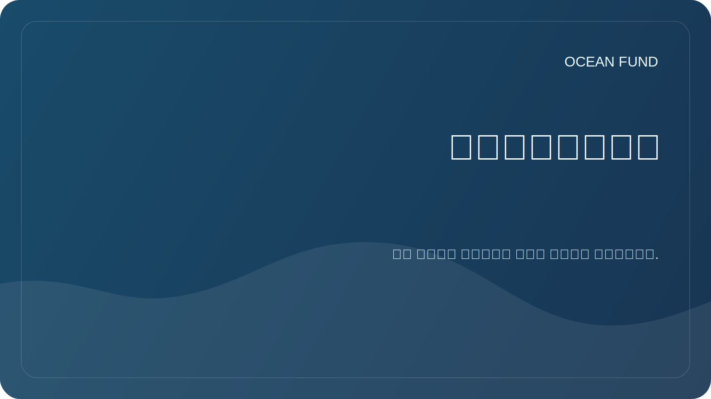

# الشراكات

مؤسسة المحيط مفتوحة للتعاون مع المنظمات التي تعمل في مجال المحيط والمناخ والتنوع البيولوجي والتعليم وبرامج المتاحف والبيانات والتواصل العلمي.

## الشركاء المحتملين

| نوع المنظمة | تنسيق ممكن |
| --- | --- |
| جامعة | المشاريع البحثية، الممارسات الطلابية، الندوات المفتوحة |
| المراكز العلمية | المراجعات التعاونية والمنهجيات وكتالوجات البيانات |
| المتاحف وأماكن المعارض | برامج تعليمية، تصورات، محاضرات عامة |
| مؤسسة | دعم البحث والتعليم والبنية التحتية المفتوحة |
| المؤتمرات | تقرير، لوحة، موقف، أحداث جانبية |
| المطورين والمجتمعات مفتوحة المصدر | أدوات تحليل البيانات وتصورها وفهرستها |

## ما ينبغي أن يكون في عرض الشراكة

- وصف موجز للمنظمة؛
- موضوع التعاون
- المساهمة المتوقعة من كل طرف؛
- نتيجة عامة؛
- توقيت وشكل الاتصال؛
- القيود المفروضة على البيانات والتراخيص والدعاية.

## ما لم نعلنه بعد

- مذكرة غير مؤكدة؛
- مؤشرات رقمية بدون مصدر؛
- التمويل بدون معلومات عامة معتمدة؛
- حالة المشروع الدولي دون وجود مشاركين مؤكدين.

توجد قوالب التواصل في [`outreach/`](../../outreach/).

## بطاقات العمل التابعة

- [`collaboration-models.md`](../../outreach/collaboration-models.md) - نماذج التعاون: ملخص البحث، سباق البيانات، محاضرة، برنامج المتحف، علم المواطن، جسر عوالم المحيطات.
- [`ocean-organization-atlas.md`](../../outreach/ocean-organization-atlas.md) - أطلس حي للمنظمات: الهياكل الدولية، الشبكات العلمية، المنظمات غير الحكومية، المؤسسات، تكنولوجيا المحيطات، الاقتصاد الأزرق، المتاحف، الفضاء.
