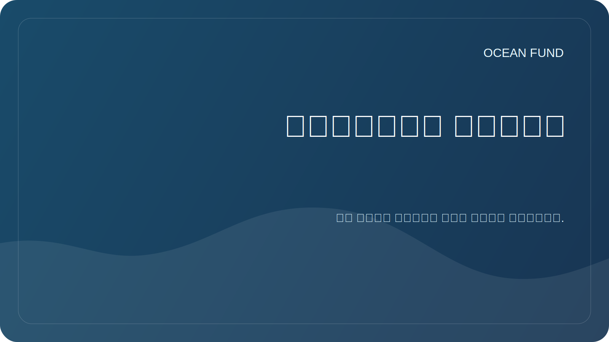

# اتجاهات البحث

تربط هذه الوثيقة مهمة المؤسسة بمسائل البحث العملي. أحد الدوافع العامة الرئيسية للمشروع: من محيط الأرض إلى محيط الفضاء.

## الاتجاهات الرئيسية

| اتجاه | السؤال الرئيسي | النتائج الأولى |
| --- | --- | --- |
| التنوع البيولوجي المحيطي | كيف تصف حالة النظم البيئية البحرية بناءً على البيانات المفتوحة؟ | مراجعة المصادر، خريطة الأنواع، قائمة المؤشرات |
| المحيط والمناخ | كيف تساعد بيانات المحيطات في تفسير تغير المناخ؟ | نظرة عامة على المتغيرات والمصادر والمرئيات |
| التلوث البحري | ما هي البيانات المفتوحة التي تساعد على تتبع التلوث والآثار البشرية؟ | مصفوفة أنواع التلوث ومصادره |
| البنية التحتية لبيانات المحيطات | كيف نجعل البيانات في متناول الباحثين والمطورين والمجتمع؟ | تسجيل مجموعة البيانات والدفاتر وقواعد البيانات الوصفية |
| الاقتصاد الأزرق | كيف يمكن مناقشة اقتصاد بحري مستدام دون تقديم وعود غير مدعومة؟ | المصطلحات والحالات ومعايير الاستدامة |
| المحيطات والفضاء | كيفية ربط محيط الأرض وبيانات الأقمار الصناعية وعوالم المحيطات وعلم الأحياء الفلكي؟ | مراجعة "الأرض كعالم محيطي"، خريطة المصدر NASA/ESA/NOAA/Copernicus، السرد "من محيط الأرض إلى محيط الفضاء" |

## نظام التشغيل البحثي

وللدراسة المتعمقة والمنتظمة للموضوع، يتم استخدام بروتوكول العمل [`ocean-intelligence-system.md`](ocean-intelligence-system.md). فهو يصف مستويات العمق، وأتمتة المراقبة، وتنسيقات النتائج، وكيفية تعامل الدستور الغذائي مع موضوعات المحيطات.

## متطلبات المواد البحثية

- التمييز بين الحقيقة والفرضية والخطة؛
- الإشارة إلى المصادر وتاريخ الوصول؛
- وتجنب التصريحات السياسية والتجارية دون دعم؛
- لا تنشر معلومات حساسة أو شخصية؛
- اكتب حتى يتمكن شريك دولي من قراءة المادة.
