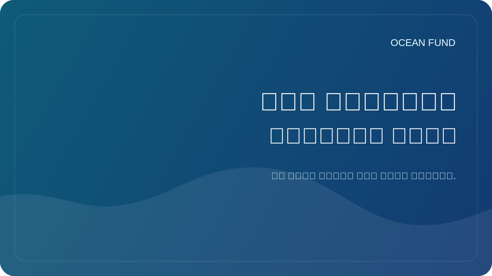

# علم المواطن والساحل الحي

غالبًا ما يظهر الخط الساحلي كحدود واضحة بين البر والبحر. ولكنها في الواقع واحدة من أكثر المناطق حيوية وحساسية وسرعة التغير على هذا الكوكب. هذا هو المكان الذي تتلاقى فيه العمليات الطبيعية والبنية التحتية والسياحة والبيئة والاقتصاد المحلي والحياة اليومية للمجتمعات. وهذا هو سبب أهمية الساحل لعلم المواطن.

إن علم المواطن مفيد ليس عندما يحل محل العلم، بل عندما يعمل على توسيع قدرة المجتمع على الملاحظة. يمكن لملاحظات المتطوعين، أو تسجيلات الصور الفوتوغرافية، أو بروتوكولات القمامة، أو تآكل السواحل، أو مشاهدات التنوع البيولوجي أو مؤشرات الجودة أن تخلق طبقة مهمة من البيانات، خاصة إذا كانت مقترنة بمنهجية واضحة واحترام القيود.

إن الشيء الجيد في موضوع الساحل الحي هو أنه يعيد جدول الأعمال المحيطي إلى المنزل. من الأسهل على الشخص أن يرى التغيرات في الشاطئ أو الطحالب أو القمامة أو البنية التحتية الساحلية أو التقلبات الموسمية في المياه من رؤية نظام مناخ المحيط المجرد ككل. ومن خلال المراقبة المحلية، يتمكن المجتمع من الدخول في المحادثة المحيطية الأكبر.

لكن علم المواطن يتطلب الحذر. ليس كل جمع البيانات مفيدا. نحن بحاجة إلى بروتوكولات واضحة، وفهم لما يتم قياسه بالضبط، وكيفية تخزين المعلومات، وما هي التحيزات الموجودة وما لا يمكن فعله بالبيانات الشخصية أو الحساسة. وبدون هذا الانضباط، يمكن أن تتحول المبادرة بسهولة إلى ضجيج.

بالنسبة لصندوق المحيط، فإن علم المواطن مثير للاهتمام باعتباره جسرًا بين المشاركة العامة وثقافة البيانات. وهذا ليس مجرد "نشاط تطوعي"، ولكنه فرصة لبناء بنية تحتية عامة لرعاية المحيطات. ومن خلاله يمكنك ربط المدارس والمنظمات غير الحكومية والمتاحف والمجتمعات الساحلية وممارسة البيانات المفتوحة.

يعد الخط الساحلي الحي صورة جيدة لهذا العمل. إنه يتغير باستمرار، ويستجيب للمناخ والنشاط الاقتصادي وعمليات النظام البيئي. وإذا تعلم المجتمع مراقبة هذه الحدود الحية عن كثب، فإنه يبدأ في فهم المحيط نفسه ودوره بجواره بشكل أفضل.
