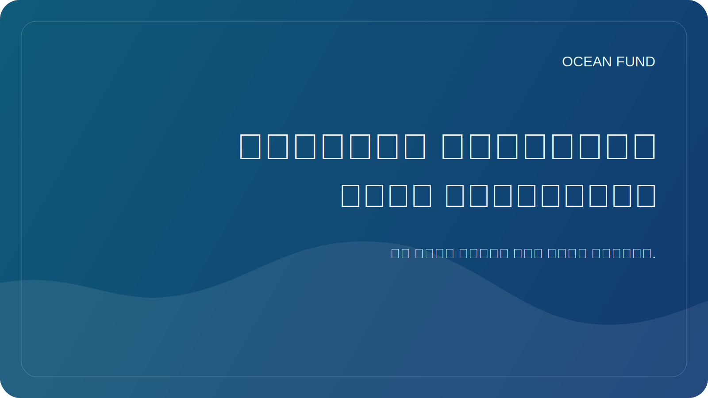

# المرونة الساحلية تبدأ بالبيانات

عندما يتحدث الناس عن مرونة السواحل، فإنهم عادة ما يفكرون في العواصف، وتآكل التربة، وارتفاع مستوى سطح البحر، والبنية التحتية، والمخاطر التي تهدد المدن. لكن المرونة الساحلية لا تبدأ بهياكل خرسانية أو عناوين مثيرة للقلق. يبدأ الأمر بمدى رؤيتنا وفهمنا لما يحدث.

السواحل هي مناطق ذات ديناميكية عالية. هنا تلتقي الأرض والبحر والعمليات الجوية وأنظمة الأنهار والنقل والسياحة والبيئة والحياة الحضرية. وحتى التغيرات الصغيرة في أنماط الأمواج، أو هطول الأمطار، أو نقل الرواسب، أو درجة حرارة الماء، أو أنماط التنمية يمكن أن تغير تدريجيا استقرار النظام الساحلي بأكمله.

وبدون البيانات، يتحول هذا التعقيد بسرعة إلى فوضى في التفسيرات. البعض يرى المناخ فقط، والبعض الآخر البنية التحتية فقط، والبعض الآخر التلوث المحلي فقط. لكن الحل المستدام يتطلب الجمع بين طبقات متعددة: عمليات رصد الأقمار الصناعية، وقياس الأعماق، والقياسات الساحلية، والسلاسل الزمنية التاريخية، وخرائط استخدام الأراضي، والمراقبة البيولوجية، والمعرفة المحلية للمجتمعات.

ليست السلطات والباحثون فقط هم الذين يحتاجون إلى بيانات ساحلية جيدة. كما أنها مهمة للمشاركة العامة. إذا كان لدى الأشخاص خرائط واضحة، وسلاسل زمنية، وتصورات للتغيير، ومواد توضيحية أنيقة، فإن المحادثة حول الساحل تصبح أقل تجريدًا. هناك مساحة لاتخاذ قرارات معقولة، وليس فقط لرد الفعل العاطفي لحالة الطوارئ القادمة.

تعتبر الأدوات المفتوحة والقابلة للتكرار ذات أهمية خاصة هنا. تستفيد المرونة الساحلية من الخرائط وبطاقات مجموعة البيانات وبروتوكولات المراقبة وعلوم المواطن وموجزات البيانات العامة. إنها تجعل الموضوع في متناول المدارس والمتاحف والمنظمات المحلية والصحفيين وأماكن الفعاليات.

بالنسبة لصندوق المحيط، فإن السواحل هي المكان الذي يلتقي فيه موضوع المحيط مباشرة بحياة المجتمع. وهنا يتبين بوضوح أن البيانات ليست ترفًا تقنيًا، ولكنها جزء من البنية التحتية المدنية والبيئية. إذا أردنا أن نتحدث عن المرونة على محمل الجد، فيجب علينا أيضًا أن نتحدث عن إمكانية الوصول إلى البيانات وجودتها وترجمتها إلى حلول عامة مفهومة.
