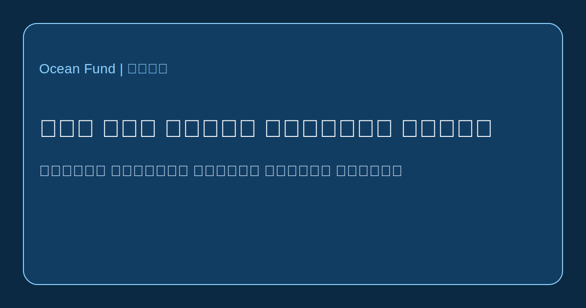

# جاك ايف كوستو والمحيط العام

لا تاتي اهمية جاك ايف كوستو من كونه مستكشفا للبحر او مخترعا او صانع افلام فقط. بل من كونه احد الشخصيات التي ساعدت على نقل المحيط من مجال مهني مغلق الى فضاء الخيال العام. قبل كوستو كان المحيط بالنسبة لكثيرين خلفية رومانسية او منطقة للممارسة العسكرية والصيد والبحث العلمي. بعد كوستو صار ايضا مسرحا عاما للمعرفة والانذار والجمال والمسؤولية.

يظهر التاريخ الرسمي لدى [Cousteau Society](https://www.cousteau.org/know/vessels/calypso/) ان كاليبسو لم تكن مجرد سفينة. لقد كانت مختبرا عائما واستوديو تصوير وبيت بعثة ومنصة للاختراع. ومن خلالها ربط كوستو بين الرحلة والصورة والتقنية والسرد. وكان هذا الربط من اعظم مساهماته. فهو لم يغص ويدرس فقط، بل بنى لغة ترى من خلالها المجتمعات العالم تحت الماء بوصفه جزءا من مستقبلها.

تكونت هذه اللغة من عدة طبقات. اولا التقنية: معدات الغوص والكاميرات تحت الماء والمركبات الصغيرة مثل [Diving Saucer](https://www.cousteau.org/know/inventions/diving-saucer/) وغرف المراقبة والشراع التوربيني ووسائل جديدة للحركة في البحر. ثانيا المسار: البحر المتوسط والبحر الاحمر والامازون والقطب الجنوبي والخليج والبحر الكورتزي والجزر والاتولات البعيدة. ثالثا الدراما العامة: فقد حوّل كوستو الرحلة العلمية الى قصة عامة.

ووفقا لبيانات Cousteau Society، قامت بعثة كاليبسو عام 1977 بمسح لتلوث البحر المتوسط عبر 13 دولة، وفي عام 1985 انطلقت رحلة حول العالم على متن كاليبسو والكيون. ولا تهم هذه المشاريع كفصول من تاريخ العلم فقط، بل تكشف ان البعثة يمكن ان تكون بحثا ودبلوماسية ومشروعا اعلاميا وتحذيرا بيئيا في الوقت نفسه.

وهنا درس مباشر لـ Ocean Fund. لا يكفي جمع البيانات او كتابة الوثائق الداخلية او تعداد مشكلات المحيط. المطلوب هو الترجمة العامة: مقالات وخرائط ونصوص معارض ومسارات مدرسية ومحاضرات وقصص بصرية وصفحات شراكة ومواد متعددة اللغات تجعل المحيط مفهوما وقريبا. لا يحل كوستو محل العلم الحديث، لكنه يذكرنا بان هناك دائما وسيطا مطلوبا بين البحث والمجتمع.

ومن المهم ايضا دراسة كوستو لا كايقونة خالية من الاخطاء، بل كنموذج للوساطة العامة للمحيط. لدينا اليوم معايير اخلاقية مختلفة وقدرات تقنية مختلفة وحجما مختلفا من التهديد البيئي. لكن المهمة بقيت نفسها: جعل المحيط ليس تجريدا، بل جزءا مرئيا من التفكير الجماعي.

اذا كان Ocean Fund يريد التقدم وفق صيغة «من محيط الارض الى محيط الفضاء»، فهو يحتاج الى هذا المستوى من اللغة العامة: ليس الدقة العلمية فقط، بل القدرة على بناء الصور ومسارات الانتباه والرابطة الطويلة بين الناس والبعثات ومياه الكوكب.
