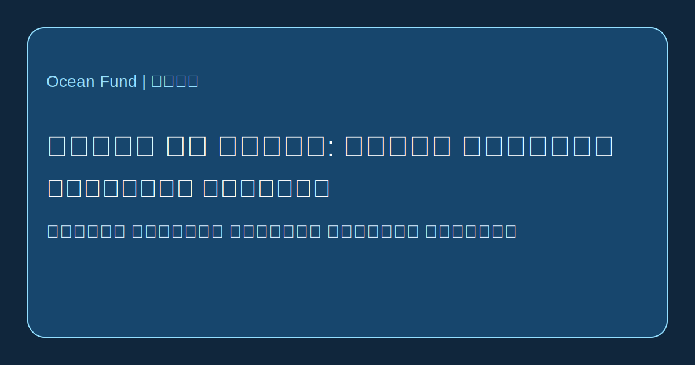

# العيش مع الماء: المدن العائمة والعمران المحيطي

لم تعد فكرة المدن فوق الماء مجرد خيال علمي، لكنها ما زالت تقف بين التجربة والهندسة والتكيف المناخي والخيال السياسي. ولهذا يجب التعامل معها من دون حماس ضبابي ومن دون رفض تلقائي. فالبنية التحتية العائمة موجودة بالفعل في عدة اشكال. والسؤال الحقيقي لم يعد هل يمكن البناء على الماء، بل ما الغرض العام من هذه النظم ومن المستفيد الفعلي منها.

في احد اطراف هذا المجال نجد مشاريع التكيف المناخي والعمراني. فقد عرضت [UN-Habitat](https://unhabitat.org/news/27-apr-2022/un-habitat-and-partners-unveil-oceanix-busan-the-worlds-first-prototype-floating) مع شركائها مشروع OCEANIX Busan كنموذج للتوسع الحضري العائم المستدام في المدن الساحلية التي تواجه ارتفاع مستوى البحر وضيق اليابسة والمخاطر المناخية. والمنطق هنا ليس الهروب من البر، بل البحث عن اشكال جديدة للتوسع الساحلي.

وفي الطرف الاخر توجد الخطوط الاكثر راديكالية المرتبطة بالاستقلالية والمجتمعات البحرية وثقافة seasteading. فـ [The Seasteading Institute](https://www.seasteading.org/about/) يصف المجتمعات العائمة بصراحة باعتبارها فضاءات للتجريب الاجتماعي، كما تعرض [active projects](https://www.seasteading.org/active-projects/) طيفا اوسع من الاتجاهات: الاستزراع البحري وكواسر الامواج والمنصات السكنية والبنية التحتية المنتجة فوق البحر. وفي الوقت نفسه تنقل شركات مثل [Ocean Builders](https://oceanbuilders.com/about-us/) هذا الموضوع نحو تصميم المنتجات والسكن المعياري والحياة فوق الامواج.

وبين هذين القطبين يوجد خط ثالث: العمارة التكيفية فوق الماء. فممارسات مثل [Waterstudio](https://www.waterstudio.nl/built-on-water-floating-houses/) لا ترى البناء العائم كيوتوبيا منفصلة، بل كامتداد للتخطيط الحضري في ظروف مائية متغيرة. وهذه المقاربة اقرب لا الى «حضارة جديدة في وسط المحيط» بل الى اعادة تصميم تدريجية للعلاقة بين المدينة والواجهة المائية والبنية التحتية وخطر الفيضانات.

وبالنسبة لـ Ocean Fund، يجب طرح عدة اسئلة معا. من سيعيش على الماء؟ وما الغرض الدقيق من النظام العائم: الرفاهية، التكيف المناخي، البحث، السياحة، الاستزراع البحري، السكن المؤقت ام التجريب العام؟ وكيف تدار النفايات والطاقة والمياه العذبة والصيانة وسهولة الوصول والسلامة والوضع القانوني؟ وكيف تختلف الاجابات بين المياه الاستوائية والمعتدلة والابرد؟

ولهذا تستحق المدن العائمة وموضوع seasteading طبقة بحثية جادة لا مجرد شعارات. ففي بعض الحالات قد تصبح ادوات مفيدة للمرونة الساحلية ولاشكال جديدة من البنية التحتية المحيطية. وفي حالات اخرى قد تتحول الى واجهات باهظة الثمن وضعيفة الصلة بالمصلحة العامة. وبين هذين الحدين يوجد العمل الحقيقي: مقارنة النماذج ومتابعة الحالات وتقييم النتائج الهندسية والبيئية والاجتماعية.

وبالنسبة لـ Ocean Fund فهذه القضية ليست موضوعا غريبا، بل جزء من خط اكبر: تعلم العيش مع الماء. فإذا صار القرن الحادي والعشرون قرن الضغط المناخي على السواحل، فستصبح لغة العمران المحيطي ضرورية ليس فقط للمعماريين والمستثمرين، بل ايضا للباحثين والصحفيين والمتاحف والمدن والمنصات ذات المنفعة العامة. والحديث عن مستقبل المحيط هو ايضا حديث عن اشكال مستقبلية للحياة فوق الماء.
