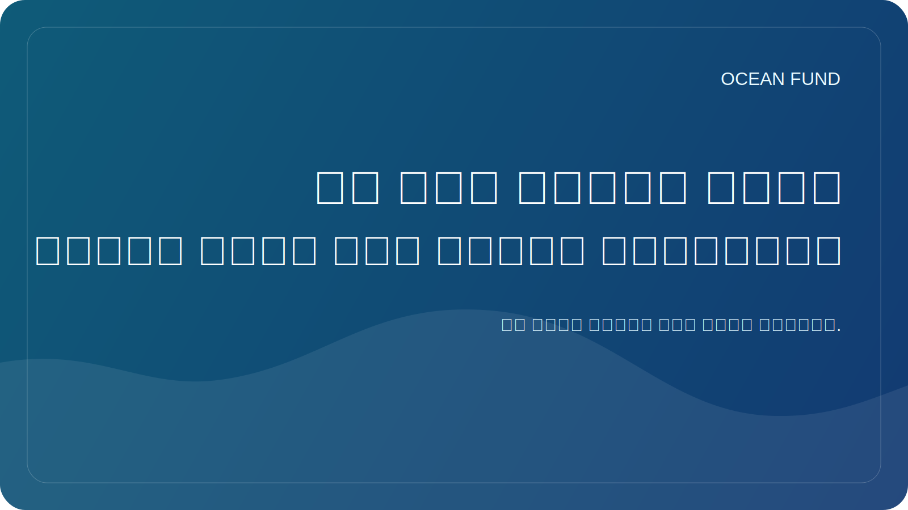

# إن رسم خريطة لقاع البحر يعني رسم خريطة للمستقبل

على الأرض، اعتدنا على التفكير في الخريطة كشيء أساسي. تبدو خرائط المدن والطرق والأنهار والحدود والتضاريس بديهية تقريبًا. ولكن عندما يتعلق الأمر بالمحيطات، وخاصة قاع البحر، فإن الصورة تتغير. لا يزال جزء كبير من التضاريس تحت الماء غير معروف بقدر كبير من التفصيل كما يود العلم الحديث والمجتمع.

هذه ليست مجرد مشكلة فنية لرسم الخرائط. يعد قاع البحر مهمًا لفهم الجيولوجيا والنظم البيئية ودورة المياه وطرق الكابلات والبنية التحتية والمخاطر المرتبطة بالانهيارات الأرضية وموجات التسونامي ومستقبل حلول أعماق البحار. وبدون خرائط قياس الأعماق الجيدة، من الصعب الحديث عن السياسة البحرية طويلة المدى والعمل المسؤول مع المحيط.

بالإضافة إلى ذلك، فإن رسم خريطة للقاع مهم رمزيًا. إنه يذكرنا أنه لا تزال هناك طبقة ضخمة من الفضاء على كوكبنا، وهي ليست مرئية لنا بوضوح كافٍ بعد. في عصر الأقمار الصناعية والمنصات الرقمية، من السهل أن ننسى مقدار العالم المادي الذي لا يزال غير موصوف بشكل كامل.

بالنسبة لصندوق المحيطات، يعتبر موضوع قاع البحر مهمًا على المستويين العلمي والثقافي. فهو يسمح لنا بالحديث عن المحيط كحدود ليس فقط بالمعنى الرومانسي، ولكن أيضًا بالمعنى العملي: حدود البيانات والملاحظات والبنية التحتية والمعرفة. من خلال قياس الأعماق، من السهل ربط العلوم والتكنولوجيا والتصور والخيال العام.

هناك جانب آخر مهم. عندما نرسم خريطة لقاع البحر، فإننا في الواقع نرسم خريطة لمساحة الحلول المستقبلية. ما هي المناطق المعرضة للخطر؟ أين توجد النظم البيئية المهمة؟ أين لا تزال معرفتنا ضعيفة للغاية؟ أين يمكن أن تساعد التكنولوجيا، وأين يجب توخي الحذر؟ ولا تصبح الخريطة مجرد صورة، بل أساسًا للتفكير.

ولذلك، فإن العمل في قاع البحر لا يقتصر على المتخصصين الضيقين وحدهم. ومن المهم أيضًا أن يفهم المجتمع لماذا لا يعتبر قاع المحيط "مساحة فارغة تحت الماء". هذا هو أحد الهياكل الكبيرة لكوكبنا. وكلما رأينا ذلك بشكل أفضل، كلما تمكنا من التحدث بمسؤولية أكبر عن مستقبل المحيط.
