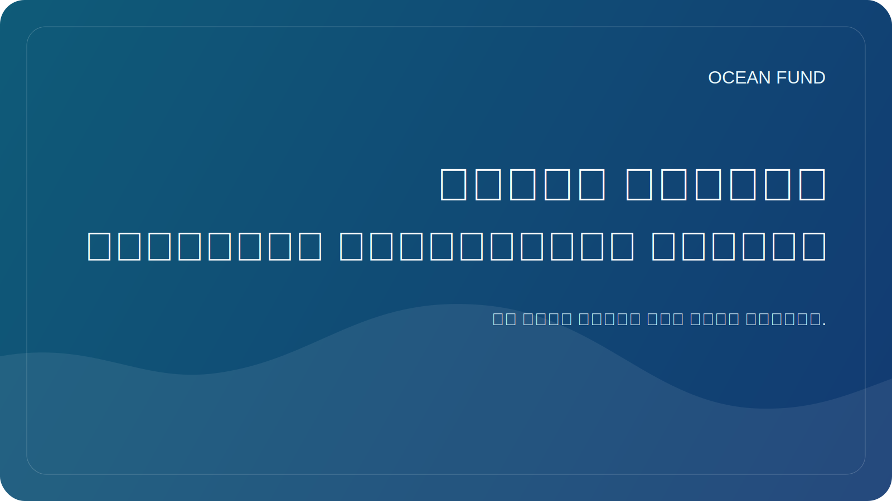

# تتطلب مؤشرات المحيطات وتقييماتها منهجية

تبدو المؤشرات والتقييمات جذابة للغاية. فهي تعد بإجراء مقارنات سريعة وأرقام واضحة وطريقة مناسبة للحديث عن الحقائق المعقدة. وفي أجندة المحيطات، يبدو هذا مغريا بشكل خاص: موضوعات كثيرة للغاية، وعدد كبير للغاية من الجهات الفاعلة، ومستويات كثيرة للغاية من عدم اليقين. أود الحصول على مؤشر بسيط واحد على الأقل.

ولكن هنا تكمن الخطورة. فكلما كان النظام أكثر تعقيداً، كلما كان من الضروري أن نكون أكثر حذراً في محاولة اختزاله إلى رقم واحد أو مقياس مقارن مناسب. إذا لم يشرح المؤشر ما هي البيانات المستخدمة، وكيف يتم اختيار الأوزان، وكيف يتم حساب الفجوات، وكيف يتم تفسير أوجه عدم اليقين، وما الذي يتم قياسه بالضبط، فإنه لا يصبح أداة للمعرفة بل أداة للوهم.

يمكن أن تكون مؤشرات المحيطات مفيدة جدًا إذا كانت تعمل بأمانة. فهي تساعد على رؤية الأنماط، وملاحظة الاختلافات بين المناطق، وبناء محادثات سياسية وإنشاء لغة مشتركة للمنظمات والجهات المانحة والباحثين والمشاريع العامة. ولكن بشرط ألا يخفي الفهرس المنهجية وراء التصور الجميل.

بالنسبة لصندوق المحيط، يعد هذا الموضوع مهمًا بشكل خاص لأن لدينا بالفعل طبقة فهرس داخلية وخارجية: ملخصات الموقع، وخرائط البيانات، والأطالس، وقوائم انتظار النشر، وموضوعات المهام. وهذا يعني أن المشروع يحتاج إلى خلق ثقافة الشفافية المنهجية منذ البداية. إذا أطلقنا على شيء ما اسم فهرس أو تصنيف أو سجل أو أطلس، فيجب علينا أن نبين بوضوح حدود هذه الأداة.

إن المؤشر الجيد لا يبسط الواقع إلى حد الفراغ. يساعدك على التنقل مع الحفاظ على صدقك. يعطي المؤشر السيئ انطباعًا بالدقة حيث لا يوجد سوى مجموعة من الإشارات غير القابلة للمقارنة بشكل جيد. والفرق بينهما هو المنهجية.

ولذلك، فإن الحديث عن المؤشرات المحيطية لا ينبغي أن يذهب فقط إلى مستوى التصميم والتواصل، ولكن أيضًا إلى مستوى المسؤولية المعرفية. الرقم بدون تفسير يمكن أن يكون أكثر خطورة من عدم وجود رقم. ومن الممكن أن يصبح الفهرس الذي يتمتع بمنطق شفاف أداة عامة قوية للإبحار في عالم محيطي معقد.
