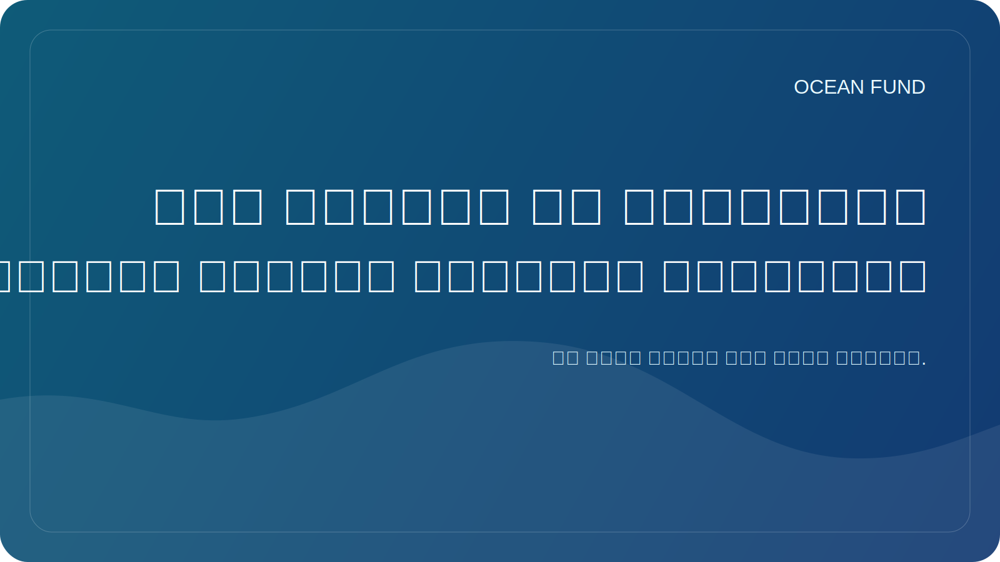

# محو الأمية في المحيطات باعتبارها البنية التحتية للمستقبل

غالبًا ما تبدو معرفة القراءة والكتابة في المحيطات وكأنها شيء إضافي: موضوع تعليمي مفيد، وشكل جيد للمتحف، وشيء جميل للبرامج المدرسية. ولكن في الواقع، يجب النظر في معرفة القراءة والكتابة في المحيطات على نطاق أوسع. وهذه ليست زخرفة للأجندة البيئية، بل هي إحدى البنى التحتية للمستقبل.

إذا كان فهم أي مجتمع للدور الذي تلعبه المحيطات ضعيفا، فسوف يكون لديه فهم أقل أهمية للمناخ، والتنوع البيولوجي، والمخاطر الساحلية، والموارد البحرية، وسلاسل التوريد العالمية، بل وحتى قدرات العلم والتكنولوجيا. الأمية المحيطية تجعل المحادثة العامة سطحية. ومن ثم تصبح القرارات تفاعلية وليست استراتيجية.

إن المعرفة الحقيقية بالمحيطات ليست مجموعة من الحقائق الجميلة عن الحيتان والشعاب المرجانية. إنها القدرة على رؤية المحيط كنظام معقد، مرتبط بالحياة على الأرض، والمناخ العالمي، والبيانات، والسياسة الدولية، وأنظمة الغذاء، وتخيل المستقبل. وهي أيضًا القدرة على التمييز بين المعرفة المثبتة علميًا وبين المعرفة المبسطة والادعاءات العصرية ولكن الضعيفة.

وفي القرن الحادي والعشرين، لا ينبغي أن يعتمد هذا النوع من محو الأمية على النصوص فحسب، بل يجب أيضًا أن يعتمد على البيانات المفتوحة والخرائط والتصورات وعلوم المواطن وممارسات المتاحف ومستودعات GitHub والموجزات العامة والمحاضرات ومواد الأحداث. وهذا يعني أننا لم نعد نتحدث عن التعليم فحسب، بل عن البنية التحتية العامة المتصلة للمعرفة.

لقد تم بناء صندوق المحيط على وجه التحديد على هذا المنطق. ليس البحث فقط مهمًا بالنسبة لنا، ولكن أيضًا أشكال ترجمة المعرفة. لا نحتاج إلى سجلات مجموعات البيانات فحسب، بل نحتاج أيضًا إلى صفحات تسجيل دخول واضحة، والصفحات الواحدة، وحزم الأحداث، وبيانات المهمة، والمقالات العامة. كل هذا ليس "تغليفًا ثانويًا"، ولكنه جزء من كيفية دخول موضوع المحيط إلى الثقافة وصنع القرار.

وبالنظر إلى المستقبل، سوف تصبح معرفة القراءة والكتابة في المحيطات أكثر أهمية. سيواجه العالم مناقشات جديدة حول الاقتصاد الأزرق، ومرونة السواحل، والتكنولوجيا البحرية، وإدارة أعماق البحار، ودور المحيط في التكيف مع المناخ. وستعتمد جودة القرارات على مدى امتلاك المجتمع لغة لهذه المحادثات.

ولذلك، ينبغي فهم القراءة والكتابة في المحيطات باعتبارها بنية تحتية. فهو ليس مرئيا مثل الميناء، أو القمر الصناعي، أو المختبر، ولكن من دونه تتدفق المعرفة بشكل سيئ، وتضعف الشراكات، وتصبح الأجندة العامة عرضة للضجيج والتلاعب. بالنسبة لصندوق المحيط، يعد العمل على مثل هذه البنية التحتية إحدى مهامه المركزية.
