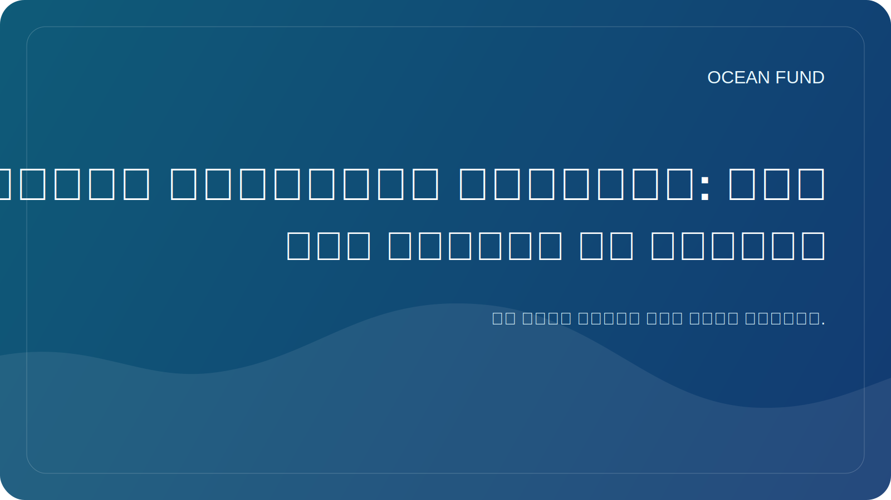

# الأقمار الصناعية والمحيط: كيف نرى الكوكب من الأعلى

إن الفهم الحديث للمحيطات مستحيل بدون الأقمار الصناعية. إذا كانت العديد من الأفكار حول البيئة البحرية تعتمد في السابق على الرحلات الاستكشافية والعوامات والقياسات الساحلية، فإن مراقبة الأرض من الفضاء تلعب اليوم دورًا كبيرًا. وهذا هو ما يمنحنا الحجم وقابلية المقارنة والقدرة على رؤية العمليات المكانية الكبيرة في الوقت الفعلي تقريبًا.

تتيح الأقمار الصناعية مراقبة درجة حرارة سطح البحر، ولون المحيط، وتوزيع الجليد، وارتفاع السطح، وأنماط التيارات الكبيرة، والعكارة، وتكاثر العوالق النباتية والعديد من الخصائص الأخرى. وهذا لا يجعل القياسات التقليدية غير ضرورية، ولكنه يعززها بشكل جذري، مما يسمح بربط الملاحظات المحلية بالصورة العالمية.

وهذا الارتباط مهم بشكل خاص بالنسبة للمناخ والاستدامة الساحلية والعمل التعليمي. عندما نرى المحيط من الأعلى، يصبح من الواضح أنه ليس "كتلة زرقاء" ثابتة، بل نظام ديناميكي له جبهات ودوامات ودورات موسمية واندفاعات بيولوجية وأنماط مناخية كبيرة. إن مراقبة الفضاء تغير نطاق إدراكنا للمحيطات.

ولكن هنا أيضا الحذر مطلوب. إن صورة القمر الصناعي ليست "صورة مباشرة للحقيقة"، ولكنها نتيجة معالجة ونماذج ومعايرة وتفسير معقدة. ولذلك، فإن العمل العام مع بيانات الأقمار الصناعية يتطلب مصادر جيدة، وإخلاء مسؤولية واضحة، وتفسيرات واضحة للقيود. وإلا فإن الصورة الجميلة قد تؤدي إلى استنتاجات غير صحيحة.

بالنسبة لصندوق المحيطات، تعتبر الطبقة التابعة ذات أهمية خاصة لأنها تربط بشكل طبيعي محيطات الأرض بمحيطات الفضاء. ندرس البيئة البحرية من خلال أدوات خارج الغلاف الجوي. وهذا يخلق جسرًا تعليميًا وفكريًا قويًا بين علم المحيطات ومراقبة الأرض والبعثات الفضائية والاستكشاف طويل المدى.

هذه إحدى نقاط القوة في الموضوع المحيطي: فهو يساعد على الحديث عن الأرض كنظام نفهمه بشكل أفضل عندما نكون قادرين على النظر إليه من الداخل ومن الأعلى. الأقمار الصناعية تجعل هذا الرأي ممكنا. ومهمة المنصات العامة مثل صندوق المحيط هي ترجمتها إلى لغة مفهومة وأنيقة ومفيدة للمجتمع.
