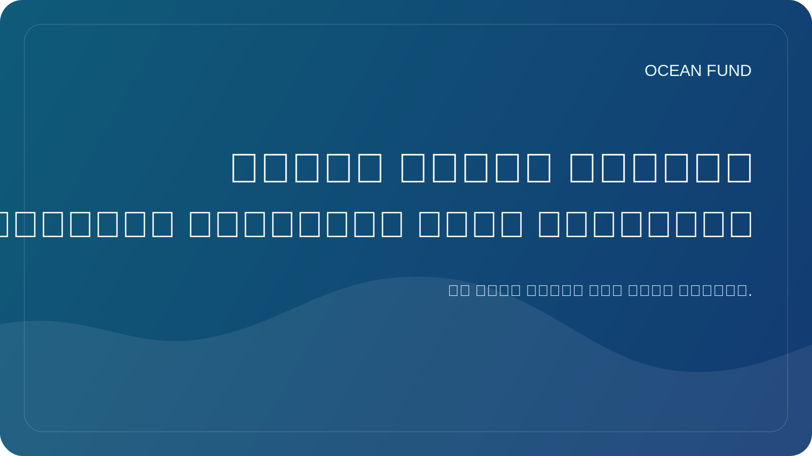

# لماذا تعتبر بيانات المحيطات المفتوحة مهمة للمجتمع؟

اليوم، أصبح الحديث عن المحيط مستحيلاً بدون بيانات. إن درجة حرارة سطح البحر، والملوحة، وقياس الأعماق، وعمليات الرصد عبر الأقمار الصناعية، وتوزيع الأنواع، وصحة المرجان، والجليد البحري، والتلوث، والمخاطر الساحلية يتم وصفها بشكل متزايد ليس بالكلمات فحسب، بل أيضًا بالقياسات. ومع ذلك، فإن البيانات وحدها لا تخلق منفعة عامة.

تعتبر بيانات المحيطات المفتوحة مهمة لأنها تسمح لمجموعات مختلفة بالعمل على نفس الواقع. يرى الباحث المادة العلمية، ويحصل المعلم على الأساس للدرس، ويمكن للمتحف إنشاء قصة مرئية، ويمكن للصحفي التحقق من المطالبة، ويمكن للمطور إنشاء أداة أو خريطة. عندما يكون الوصول إلى البيانات مفتوحًا، تتوقف أجندة المحيطات عن كونها ناديًا محترفًا مغلقًا.

لكن الانفتاح لا يعني سهولة الفهم التلقائي. وحتى البيانات الجيدة غالبًا ما يظل من الصعب استخدامها خارجيًا. قد تحتوي المجموعة على ترخيص معقد، أو قيود غير واضحة، أو تنسيق تقني غير مفهوم لغير المتخصص، أو بيانات وصفية تتطلب ترجمة منفصلة إلى لغة بشرية. لذا، بين "البيانات موجودة" و"يمكن للمجتمع استخدامها" يكمن الكثير من أعمال التفسير.

وهذا هو المكان الذي تكون فيه بطاقات مجموعات البيانات، وسجلات المصادر، والمعاجم، والدفاتر، وبطاقات العرض التوضيحي، والملخصات الأنيقة التي تواجه الجمهور ذات أهمية خاصة. إنها لا تحل محل العلم، ولكنها تخلق جسرًا بين المتخصص والجمهور الخارجي. إن مثل هذا الجسر ضروري ليس فقط للتعليم. كما أنها ضرورية لإجراء محادثة أكثر مسؤولية حول المخاطر والبنية التحتية والمناخ والسياسة الساحلية والحفاظ على البيئة.

كما تعمل البيانات المفتوحة على تقليل الاعتماد على المطالبات الوهمية والفارغة. إذا كان المشروع يتحدث عن المحيط، أو حماية المحيطات، أو المراقبة، أو الاقتصاد الأزرق، فيجب أن تكون هناك طريقة للتحقق من الصياغة التي تستند إليها. إن وجود مصدر مفتوح وتاريخ الوصول ووصف القيود وحالة التحقق يجعل الخطاب العام أقوى وأكثر صدقًا.

بالنسبة لصندوق المحيطات، تعد بيانات المحيطات المفتوحة أكثر من مجرد مورد تقني. وهذا هو أساس الثقة العامة والعمل التربوي والتعاون الدولي. من خلال البيانات المفتوحة، يمكنك بناء الخرائط والمحاضرات والموجزات ومواد الأحداث ومقترحات الشراكة والأسئلة البحثية. فهي تساعد في ربط علوم المحيطات بالمجتمع دون فقدان الدقة.

وفي المستقبل، سوف تتزايد أهمية هذه الطبقة. ومع توفر المزيد من مهمات الأقمار الصناعية، وشبكات الاستشعار، والمنصات تحت البحر، وبرامج المراقبة العالمية، فإن البنية التحتية التي تمنعنا من الغرق في طوفان المعلومات سوف تصبح أكثر أهمية. ولا يحتاج المجتمع إلى بوابات البيانات فحسب، بل يحتاج إلى أنظمة ملاحة واضحة تعتمد على بيانات المحيطات. ولم يعد إنشاء مثل هذه الأنظمة مهمة ثانوية، بل أصبح جزءا من الثقافة المحيطية الحديثة.
