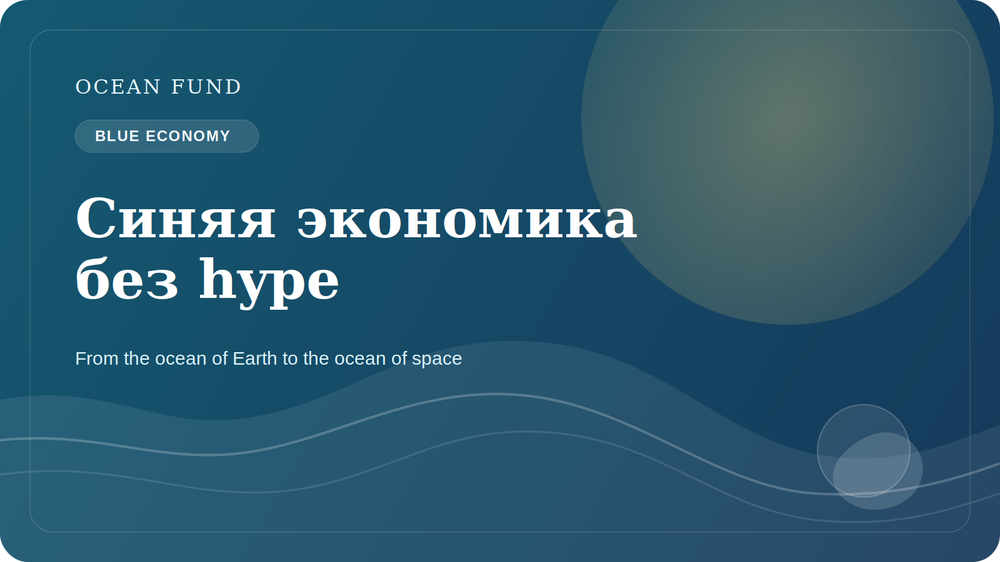

# Синяя экономика без тумана и hype

Термин “синяя экономика” стал очень популярным. Его используют правительства, инвесторы, технологические компании, НКО, международные организации и организаторы форумов. Но чем шире используется этот язык, тем выше риск, что он превратится в красивую оболочку, которая скрывает слишком разные и иногда противоречивые практики.

В сильном смысле синяя экономика должна означать такую работу с океаном, которая соединяет экономическую деятельность с сохранением экосистем, научной аккуратностью, долгосрочной устойчивостью и справедливым распределением выгод. Это может включать устойчивое рыболовство, аквакультуру, marine data services, мониторинг, прибрежную адаптацию, экологичные технологии, образование и финансовые механизмы, которые не разрушают саму основу океанической жизни.

Но на практике под blue economy иногда пытаются подвести почти любую морскую активность, даже если ее экологические и социальные последствия плохо поняты. Именно поэтому для Ocean Fund важно работать с этой темой без hype. Нужны не общие лозунги, а ясные вопросы: какие данные подтверждают заявленную пользу? как учитываются риски? кто выигрывает? кто несет издержки? как измеряется результат?

Такой подход полезен и для партнерств, и для публичной коммуникации. Он помогает отделять реальную устойчивость от маркетинговой окраски. В океанической сфере это особенно важно, потому что многие решения выглядят инновационно и красиво, но их долгосрочные эффекты могут быть неоднозначными или недостаточно проверенными.

Здоровый язык синей экономики должен включать ограничения, а не только возможности. Он должен признавать, что океан — не бесконечный ресурсный резервуар, а сложная живая система. И если экономика хочет оставаться действительно “синей”, ей придется научиться работать не против этой сложности, а внутри нее.

Для Ocean Fund тема blue economy — это не способ добавить модный термин в публичную речь. Это возможность строить более точный разговор о будущем океана, в котором есть место и технологиям, и данным, и финансам, и экосистемной ответственности. Без такой связки понятие быстро теряет смысл. С ней оно может стать одной из важных рамок XXI века.

