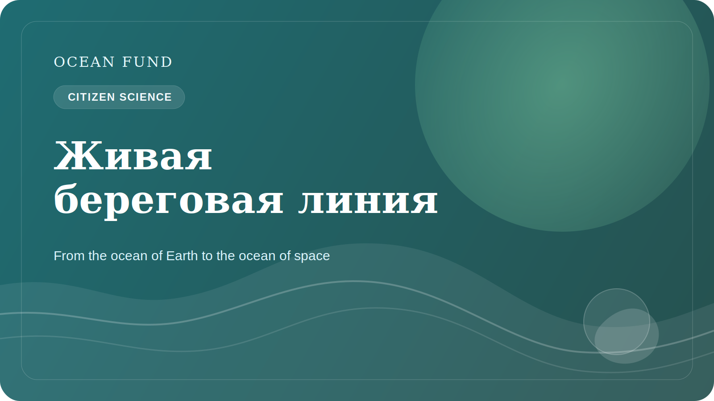

# Citizen science и живая береговая линия

Береговая линия часто выглядит как очевидная граница между сушей и морем. Но на самом деле это одна из самых живых, чувствительных и быстро меняющихся зон планеты. Здесь сходятся природные процессы, инфраструктура, туризм, экология, локальная экономика и повседневная жизнь сообществ. Именно поэтому побережье так важно для citizen science.

Citizen science полезна не тогда, когда заменяет науку, а тогда, когда расширяет наблюдательную способность общества. Волонтерские наблюдения, фотофиксация, протоколы по мусору, береговой эрозии, biodiversity sightings или quality indicators могут создавать важный слой данных, особенно если они соединены с понятной методикой и уважением к ограничениям.

Тема живой береговой линии хороша тем, что она делает океаническую повестку близкой. Человеку проще увидеть изменение пляжа, водорослей, мусора, прибрежной инфраструктуры или сезонных колебаний воды, чем абстрактную ocean-climate system целиком. Через локальное наблюдение общество получает вход в более широкий океанический разговор.

Но citizen science требует аккуратности. Не всякий сбор данных полезен. Нужны ясные протоколы, понимание, что именно измеряется, как хранится информация, какие есть biases и что нельзя делать с персональными или чувствительными данными. Без этой дисциплины инициатива может легко превратиться в шум.

Для Ocean Fund citizen science интересна как мост между public engagement и data culture. Это не просто “волонтерская активность”, а возможность строить общественную инфраструктуру внимательности к океану. Через нее можно соединять школы, НКО, музеи, coastal communities и open-data practice.

Живая береговая линия — хороший образ для этой работы. Она постоянно меняется, реагирует на климат, хозяйственную деятельность и экосистемные процессы. И если общество учится наблюдать эту живую границу более внимательно, оно начинает лучше понимать и сам океан, и свою собственную роль рядом с ним.

