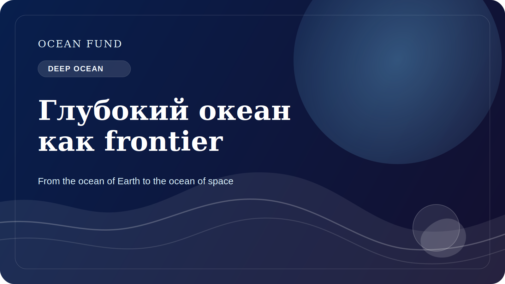

# Глубокий океан как неизвестная планета на Земле

О глубоком океане принято говорить как о чем-то удаленном, темном и почти недоступном. В этом есть правда, но есть и более точная формула: глубокий океан — это одна из крупнейших малоизученных сред на нашей собственной планете.

На больших глубинах меняются давление, температура, освещенность и доступность энергии. Там существуют экосистемы, приспособленные к условиям, которые долго казались почти несовместимыми с активной жизнью. Гидротермальные источники, глубоководные равнины, подводные горы и зоны разломов показывают, насколько ограниченным может быть наш интуитивный взгляд на обитаемость.

Именно поэтому глубокий океан так важен не только для океанографии, но и для более широкой науки. Он помогает задавать вопросы о происхождении и границах жизни, о биогеохимических циклах, о роли малоизученных экосистем в устойчивости океана и о том, как человечество должно вести себя в среде, которую оно все еще понимает фрагментарно.

Сегодня глубокий океан всё чаще оказывается в центре экономических и политических дискуссий. Растет интерес к подводной добыче, к глубоководному картированию, к военному и промышленному использованию, к новым автономным системам и к расширению инфраструктуры наблюдений. Но именно в этот момент особенно важно не подменить знание технологическим азартом.

Глубокий океан требует дисциплины неопределенности. Нам нужно признавать, что карта неполна, экосистемы описаны частично, а последствия вмешательства могут проявляться медленно и неочевидно. В этом смысле глубоководная тема полезна и для общественного мышления: она напоминает, что прогресс не должен означать автоматическую эксплуатацию любой доступной среды.

Для Ocean Fund глубокий океан важен как интеллектуальный мост между исследованиями Земли и воображением других миров. Если мы до конца не понимаем собственные глубины, то тем более стоит внимательно относиться к рассказам о подледных океанах Европы или Энцелада. Глубокий океан Земли — это и научный frontier, и школа эпистемической скромности.

