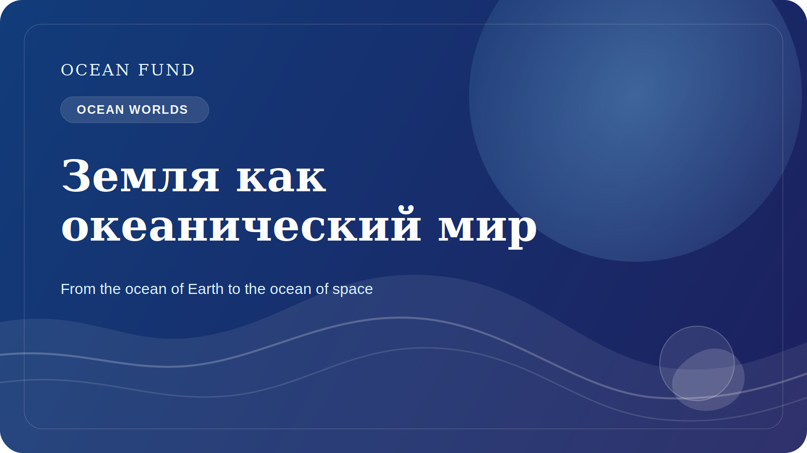

# Земля как океанический мир

Идея “океанических миров” обычно связывается с космосом. Европа, Энцелад, Титан и другие объекты Солнечной системы интересуют ученых потому, что под их ледяными оболочками или в сложных средах могут существовать огромные объемы воды. Через эту тему наука задает один из самых глубоких вопросов: где еще возможны условия для жизни?

Но чтобы по-настоящему понять ocean worlds, полезно сначала посмотреть на Землю как на океанический мир. На нашей планете океан покрывает большую часть поверхности, регулирует климат, связывает континенты, формирует глобальные циклы вещества и энергии и создает условия для удивительного разнообразия жизни. Земля — не просто “планета с океаном”. Во многих смыслах это океаническая планета.

Такой взгляд меняет и образовательный, и научный разговор. Когда мы смотрим на Землю как на ocean world, океанография перестает быть только региональной дисциплиной про побережья, течения и глубины. Она становится частью гораздо более широкого вопроса о том, как вода, энергия, химия, геология и биология соединяются в систему, способную поддерживать жизнь.

Здесь особенно важен мост между океанологией и космическими наблюдениями. Спутники помогают видеть температуру, цвет океана, лед, высоту поверхности моря, крупные структуры циркуляции и прибрежные изменения. В то же время исследования ледяных спутников, подледных океанов и астробиологии возвращают нас к Земле с новыми вопросами. Какие экстремальные среды на нашей планете могут служить аналогами? Что глубокий океан учит нас о жизни в темноте, под давлением и в энергетически ограниченных системах? Как общество может лучше понимать океан, если смотреть на него сразу как на дом жизни и как на научную модель для других миров?

Для Ocean Fund формула “от океана Земли к океану космоса” важна именно поэтому. Она не уводит разговор от Земли, а наоборот, усиливает его. Она помогает показать, что океаническая тема связана не только с экологией и климатом, но и с воображением, исследованием, технологией наблюдения и долгосрочным пониманием обитаемости.

Такой язык особенно полезен для музеев, планетариев, научных фестивалей, образовательных программ и междисциплинарных событий. Он связывает океан, данные, спутники, биологию, климат и космос в одну понятную историю. И если эта история построена аккуратно, без сенсационности и без псевдонаучного тумана, она может стать мощным способом вовлечения новых людей в океаническую повестку.

Земля уже дает нам доступ к океаническому миру, в котором мы живем. Понять его глубже — значит одновременно лучше понять и нашу собственную планету, и горизонты будущих исследований за ее пределами.

