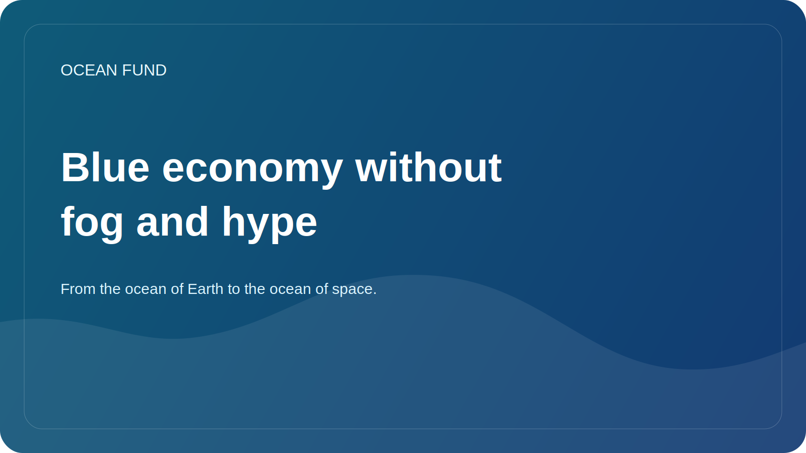

# Blue economy without fog and hype

The term “blue economy” has become very popular. It is used by governments, investors, technology companies, NGOs, international organizations and forum organizers. But the more this language is used, the greater the risk that it will become a beautiful shell that hides too different and sometimes contradictory practices.

In a strong sense, a blue economy should mean working with the ocean that connects economic activity with ecosystem conservation, scientific rigor, long-term sustainability and fair distribution of benefits. This may include sustainable fisheries, aquaculture, marine data services, monitoring, coastal adaptation, green technologies, education and financial mechanisms that do not destroy the very basis of ocean life.

But in practice, there are sometimes attempts to subsume almost any maritime activity under the blue economy, even if its environmental and social consequences are poorly understood. That is why it is important for Ocean Fund to work with this topic without hype. What is needed is not general slogans, but clear questions: what data support the claimed benefits? How are risks taken into account? who wins? who bears the costs? How is the result measured?

This approach is useful for both partnerships and public communications. It helps separate real sustainability from marketing hype. In the ocean space, this is especially important because many solutions look innovative and beautiful, but their long-term effects may be ambiguous or under-tested.

A healthy blue economy language must include constraints, not just opportunities. It must recognize that the ocean is not an endless reservoir of resources, but a complex living system. And if the economy wants to remain truly “blue,” it will have to learn to work not against this complexity, but within it.

For Ocean Fund, the blue economy theme is not a way to add a buzzword to public discourse. This is an opportunity to build a more precise conversation about the future of the ocean, which includes technology, data, finance, and ecosystem responsibility. Without such a connection, the concept quickly loses its meaning. With it, it can become one of the important frameworks of the 21st century.
