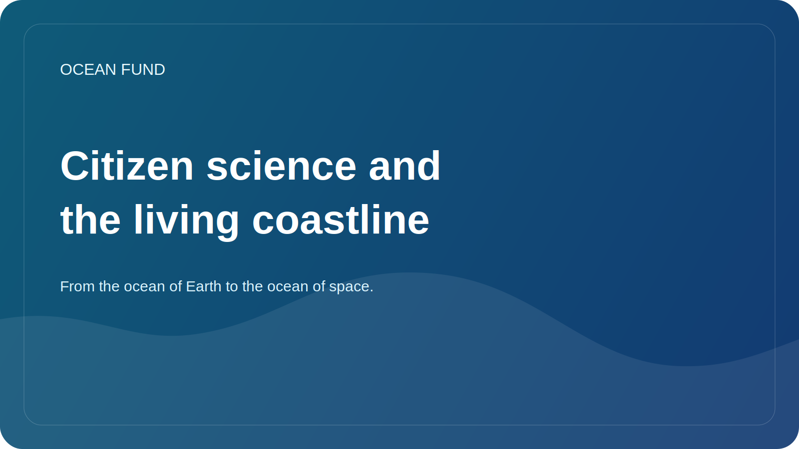

# Citizen science and the living coastline

The coastline often appears as an obvious boundary between land and sea. But in fact, it is one of the most vibrant, sensitive and rapidly changing areas on the planet. This is where natural processes, infrastructure, tourism, ecology, local economics and the daily life of communities converge. This is why the coast is so important for citizen science.

Citizen science is useful not when it replaces science, but when it expands society's observational capacity. Volunteer observations, photographic recordings, litter protocols, coastal erosion, biodiversity sightings or quality indicators can create an important layer of data, especially if they are coupled with clear methodology and respect for limitations.

The good thing about the living coastline theme is that it brings the oceanic agenda home. It is easier for a person to see changes in the beach, algae, garbage, coastal infrastructure or seasonal fluctuations in water than the abstract ocean-climate system as a whole. Through local observation, society gains entry into the larger oceanic conversation.

But citizen science requires caution. Not all data collection is useful. We need clear protocols, an understanding of what exactly is being measured, how information is stored, what biases there are and what cannot be done with personal or sensitive data. Without this discipline, initiative can easily turn into noise.

For the Ocean Fund, citizen science is interesting as a bridge between public engagement and data culture. This is not just “volunteer activity”, but an opportunity to build a public infrastructure of care for the ocean. Through it you can connect schools, NGOs, museums, coastal communities and open-data practice.

A living coastline is a good image for this work. It is constantly changing, responding to climate, economic activity and ecosystem processes. And if society learns to observe this living boundary more closely, it begins to better understand both the ocean itself and its own role next to it.
