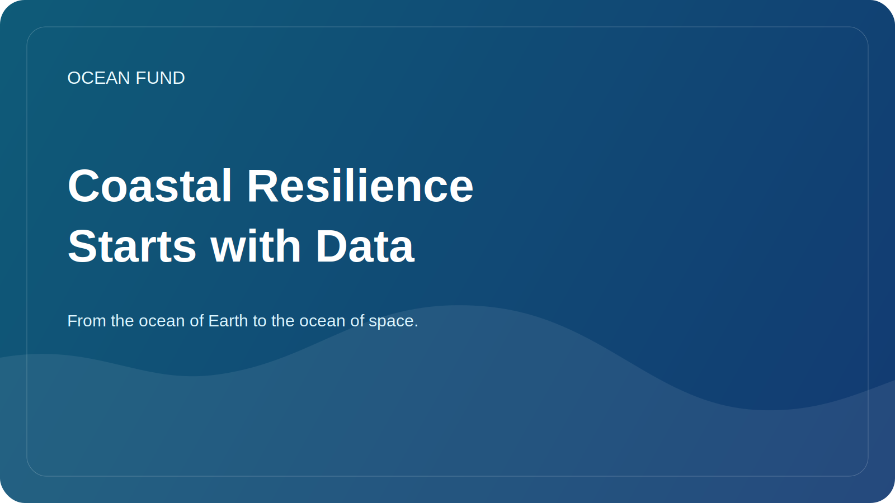

# Coastal Resilience Starts with Data

When people talk about coastal resilience, they usually think of storms, erosion, sea level rise, infrastructure, and risks to cities. But coastal resilience doesn't start with concrete structures or alarming headlines. It starts with how well we see and understand what is happening.

Coasts are areas of high dynamics. Here land, sea, atmospheric processes, river systems, transport, tourism, ecology and urban life meet. Even small changes in wave patterns, precipitation, sediment transport, water temperature, or development patterns can gradually change the stability of an entire coastal system.

Without data, this complexity quickly devolves into a chaos of interpretations. Some see only climate, others only infrastructure, others only local pollution. But a sustainable solution requires combining multiple layers: satellite observations, bathymetry, coastal measurements, historical time series, land use maps, biological observations and local knowledge of communities.

It's not just authorities and researchers who need good coastal data. They are also important for public participation. If people have clear maps, time series, change visualizations, and neat explanatory materials, the conversation about the coast becomes less abstract. There is space for reasonable decisions, and not just for an emotional reaction to the next emergency.

Open and reproducible tools are especially important here. Coastal resilience benefits from maps, dataset cards, observational protocols, citizen science and public data briefs. They make the topic more accessible to schools, museums, local organizations, journalists and event venues.

For the Ocean Fund, the coasts are where the ocean theme directly meets the life of society. This is where it is clearly seen that data is not a technical luxury, but part of the civil and environmental infrastructure. If we want to talk about resilience seriously, we must also talk about accessibility, quality and translation of data into understandable public solutions.
