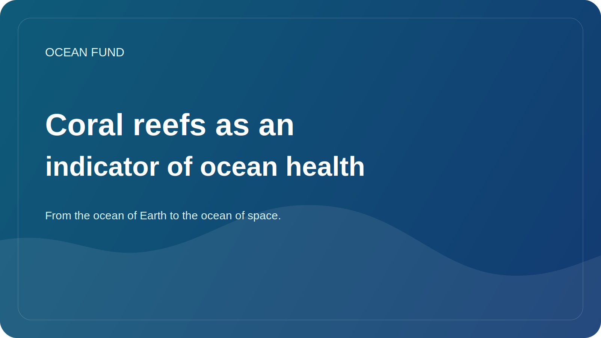

# Coral reefs as an indicator of ocean health

Coral reefs are often perceived as beautiful exotics, fit for postcards, films and travel brochures. But in a scientific and social sense, reefs are much more important. They act as a sensitive indicator of ocean conditions and one of the clearest signals of how quickly the marine environment is changing.

Reefs are extremely rich in life. In a relatively small area, they support a huge diversity of organisms: fish, invertebrates, algae, microbial communities and a variety of interconnected life forms. Therefore, reef degradation means not only the loss of a particular landscape, but also the destruction of complex ecosystem architecture.

It is especially important that reefs are very sensitive to overheating of water. Marine heat waves, changing ocean chemistry, local pollution, mechanical disturbances and unsustainable coastal use quickly affect the health of corals. When we see bleaching or massive weakening of reefs, it is not a local “trouble” but part of a larger pattern of ocean stress.

At the same time, reefs have not only natural, but also social significance. They relate to fisheries, tourism, coastal protection and the resilience of local communities. For many regions, the reef is simultaneously a living environment, a source of income, a cultural reality and a natural barrier that cushions the effects of waves and storms.

Talking about reefs is also useful because it makes the ocean topic clearer to a wider audience. Reefs can explain climate, biodiversity, ocean acidity, marine protected areas, satellite observations and the need for long-term monitoring. This is one of those topics where scientific accuracy and public communication can reinforce each other.

For the Ocean Fund, the topic of corals is important as part of a larger question: how to translate complex ocean changes into language that is understandable to the public without losing scientific rigor. Reefs provide a powerful entry point into this conversation because they are simultaneously beautiful, vulnerable, revealing, and deeply connected to the future of the ocean.
