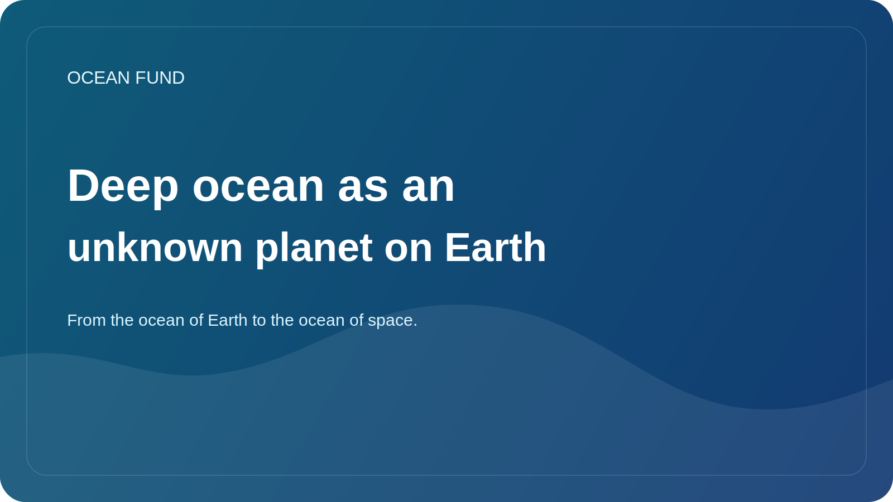

# Deep ocean as an unknown planet on Earth

It is customary to speak of the deep ocean as something remote, dark and almost inaccessible. There is truth to this, but there is also a more accurate formula: the deep ocean is one of the largest underexplored environments on our own planet.

At great depths, pressure, temperature, light and energy availability change. There are ecosystems adapted to conditions that for a long time seemed almost incompatible with active life. Hydrothermal vents, deep-sea plains, seamounts, and fracture zones show how limited our intuitive view of habitability can be.

This is why the deep ocean is so important not only for oceanography, but also for broader science. It helps ask questions about the origins and limits of life, biogeochemical cycles, the role of little-understood ecosystems in ocean resilience, and how humanity should behave in an environment it still only understands fragmentarily.

Today, the deep ocean is increasingly at the center of economic and political discussions. There is growing interest in subsea mining, deep-sea mapping, military and industrial applications, new autonomous systems, and expanding observing infrastructure. But it is at this moment that it is especially important not to replace knowledge with technological passion.

The deep ocean requires the discipline of uncertainty. We need to recognize that the map is incomplete, ecosystems are only partially described, and the effects of interventions may be slow and unobvious. In this sense, the deep-sea theme is also useful for social thinking: it reminds that progress should not mean automatic exploitation of any available environment.

For the Ocean Fund, the deep ocean is important as an intellectual bridge between exploration of Earth and the imagination of other worlds. If we do not fully understand our own depths, then it is all the more worthwhile to be attentive to stories about the subglacial oceans of Europa or Enceladus. The Earth's deep ocean is both a scientific frontier and a school of epistemic modesty.
