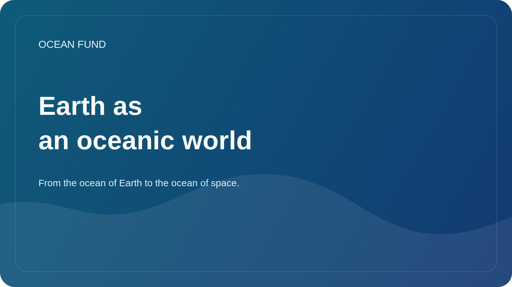

# Earth as an oceanic world

The idea of ​​“ocean worlds” is usually associated with space. Europa, Enceladus, Titan and other objects in the solar system are of interest to scientists because huge volumes of water can exist under their icy shells or in complex environments. Through this topic, science asks one of the deepest questions: where else are conditions for life possible?

But to truly understand ocean worlds, it helps to first look at Earth as an ocean world. On our planet, the ocean covers most of the surface, regulates climate, connects continents, shapes global cycles of matter and energy, and creates the conditions for an amazing diversity of life. The Earth is not just a “planet with an ocean.” In many ways it is an oceanic planet.

This perspective changes both the educational and scientific conversation. When we look at the Earth as an ocean world, oceanography ceases to be just a regional discipline about coasts, currents and depths. It becomes part of a much larger question about how water, energy, chemistry, geology and biology come together to form a system that can support life.

The bridge between oceanology and space observations is especially important here. Satellites help us see temperature, ocean color, ice, sea surface height, large circulation patterns and coastal changes. At the same time, research into icy moons, subglacial oceans, and astrobiology is bringing new questions back to Earth. What extreme environments on our planet can serve as analogues? What does the deep ocean teach us about life in darkness, under pressure, and in energy-constrained systems? How can society better understand the ocean if it is seen both as the home of life and as a scientific model for other worlds?

For the Ocean Fund, the formula “from the ocean of the Earth to the ocean of space” is important for this reason. It does not take the conversation away from the Earth, but on the contrary, it strengthens it. It helps show that the ocean theme is not just about ecology and climate, but also about imagination, exploration, observational technology, and long-term understanding of habitability.

This language is especially useful for museums, planetariums, science festivals, educational programs, and interdisciplinary events. It connects the ocean, data, satellites, biology, climate and space into one understandable story. And if this story is told carefully, without sensationalism and without pseudoscientific fog, it can be a powerful way to engage new people in the ocean agenda.

The Earth already gives us access to the oceanic world in which we live. To understand it more deeply is to simultaneously better understand both our own planet and the horizons for future exploration beyond it.
