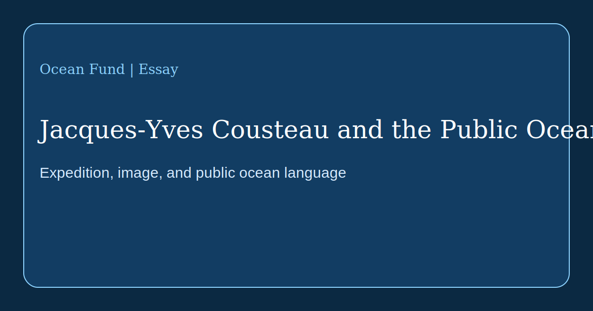

# Jacques-Yves Cousteau and the Public Ocean

Jacques-Yves Cousteau matters not only as a marine explorer, inventor, or filmmaker. He matters as one of the figures who helped move the ocean from a closed professional domain into the realm of mass imagination. Before Cousteau, the ocean was for many people either a romantic backdrop or a zone of military, fishing, and scientific practice. After Cousteau, it also became a public stage for knowledge, alarm, beauty, and responsibility.

The official history of the [Cousteau Society](https://www.cousteau.org/know/vessels/calypso/) shows that Calypso was not merely a ship. It was a floating laboratory, film studio, expedition home, and invention platform. Through it, Cousteau linked voyage, image, technology, and narrative. That combination was one of his greatest contributions. He did not only dive and investigate. He built a language through which society could see the underwater world as part of its own future.

That language was made of several layers. First, technology: scuba systems, underwater cameras, submersibles such as the famous [Diving Saucer](https://www.cousteau.org/know/inventions/diving-saucer/), observation chambers, the turbosail, and new modes of ocean mobility. Second, route: the Mediterranean, the Red Sea, the Amazon, Antarctica, the Persian Gulf, the Sea of Cortez, remote atolls and islands that a scientific paper alone would never have carried into the minds of millions. Third, dramaturgy: Cousteau turned the expedition into a public story.

According to the Cousteau Society, in 1977 the Calypso team carried out a pollution survey across 13 Mediterranean countries, and in 1985 it launched a round-the-world expedition aboard Calypso and Alcyone. These projects matter not only as episodes in scientific history. They show that an expedition can be research, diplomacy, media production, and ecological warning at the same time.

For Ocean Fund, the lesson is direct. It is not enough to collect data, draft internal documents, or list ocean problems. Public translation is required: essays, maps, exhibition texts, school routes, lectures, visual stories, partner pages, and multilingual materials that make the ocean legible and near. Cousteau does not replace modern science, but he reminds us that between research and society there must always be a medium.

It is also important to study Cousteau not as a flawless icon but as a model of public ocean mediation. We now have different ethical standards, different technical capacities, and a different scale of ecological threat. But the task remains the same: to make the ocean not an abstraction but a visible part of collective thought.

If Ocean Fund wants to advance the formula “From the ocean of Earth to the ocean of space,” it needs this level of public language: not only scientific accuracy, but the ability to build images, routes of attention, and a durable bond between people, expeditions, and planetary water.
