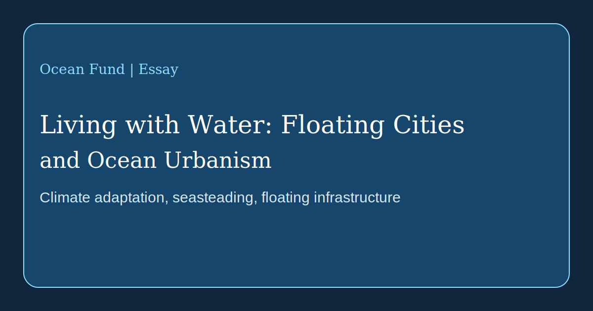

# Living with Water: Floating Cities and Ocean Urbanism

The theme of cities on water has long ceased to be pure science fiction, yet it still sits on the edge between experiment, engineering, climate adaptation, and political imagination. That is why it should be approached without euphoric haze and without automatic dismissal. Floating infrastructure already exists in several forms. The real question is no longer whether building on water is possible, but what public purpose such systems serve and whom they actually benefit.

On one side of this field are projects of climate and urban adaptation. [UN-Habitat](https://unhabitat.org/news/27-apr-2022/un-habitat-and-partners-unveil-oceanix-busan-the-worlds-first-prototype-floating), together with partners, presented OCEANIX Busan as a prototype for sustainable floating urban expansion in coastal cities facing sea-level rise, land scarcity, and climate risk. The logic here is not escape from land, but the search for new forms of shoreline development.

On the other side are more radical lines linked to autonomy, marine communities, and seasteading culture. [The Seasteading Institute](https://www.seasteading.org/about/) openly frames floating communities as spaces for social experimentation, while its [active projects](https://www.seasteading.org/active-projects/) show a broader range of directions: mariculture, wave barriers, residential platforms, and productive ocean infrastructure. In parallel, companies such as [Ocean Builders](https://oceanbuilders.com/about-us/) translate the theme into product design, modular housing, and life above the waves.

Between these poles stands a third line: adaptive water architecture. Practices such as [Waterstudio](https://www.waterstudio.nl/built-on-water-floating-houses/) approach floating construction not as a detached utopia, but as an extension of urban planning under changing water conditions. This logic is closer not to “a new civilization in the open ocean,” but to the gradual redesign of relationships between the city, the waterfront, infrastructure, and flood risk.

For Ocean Fund, several questions must be held together at once. Who will live on water? What is the floating system for: luxury, climate adaptation, research, tourism, mariculture, temporary housing, or public experimentation? How are waste, energy, freshwater, maintenance, accessibility, safety, and legal status handled? And how do these answers shift across equatorial, temperate, and colder waters?

That is why seasteading and floating cities deserve not slogans but a serious research layer. In some cases they may become useful tools for coastal resilience and new kinds of ocean infrastructure. In others they may turn into expensive showcases only weakly tied to public benefit. Between those extremes lies the real work: comparing models, tracking case studies, and evaluating engineering, ecological, and social consequences.

For Ocean Fund, this theme matters not as an exotic side story but as part of a larger line: learning to live with water. If the 21st century becomes a century of climate pressure on coasts, then the language of ocean urbanism will be needed not only by architects and investors, but also by researchers, journalists, museums, cities, and public-interest platforms. To talk about the future of the ocean is also to talk about future forms of life on water.
