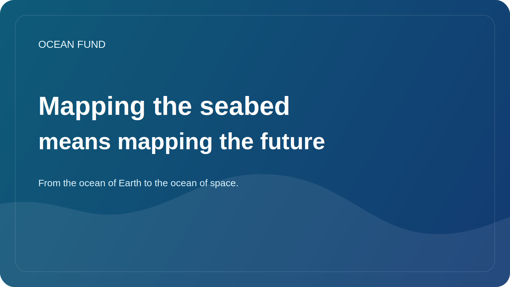

# Mapping the seabed means mapping the future

On land, we are used to thinking of a map as something basic. Maps of cities, roads, rivers, borders and terrain seem almost self-evident. But when it comes to the ocean, especially the seabed, the picture changes. A significant part of the underwater relief is still not known in as much detail as modern science and society would like.

This is not just a technical problem of cartography. The seabed is important for understanding geology, ecosystems, circulation, cable and infrastructure routes, risks associated with landslides and tsunamis, and the future of deep-sea solutions. Without good bathymetric maps it is difficult to talk about long-term marine policy and responsible work with the ocean.

In addition, mapping the bottom is important symbolically. It reminds us that on our own planet there remains a huge layer of space that is not yet visible to us clearly enough. In the age of satellites and digital platforms, it is easy to forget how much of the physical world is still incompletely described.

For the Ocean Fund, the topic of the seabed is important both scientifically and culturally. It allows us to talk about the ocean as a frontier not only in a romantic sense, but also in a practical sense: a frontier of data, observations, infrastructure and knowledge. Through bathymetry it is convenient to connect science, technology, visualization and public imagination.

There is another important aspect. When we map the seafloor, we are actually mapping the space of future solutions. Which areas are vulnerable? Where are the important ecosystems? Where is our knowledge still too weak? Where can technology help, and where is more caution needed? The map becomes not just an image, but a basis for thinking.

Therefore, working on the seabed is not a matter for narrow specialists alone. It is also important for society to understand why the ocean floor is not “empty space under water.” This is one of the large structures of our planet. And the better we see it, the more responsible we can talk about the future of the ocean.
