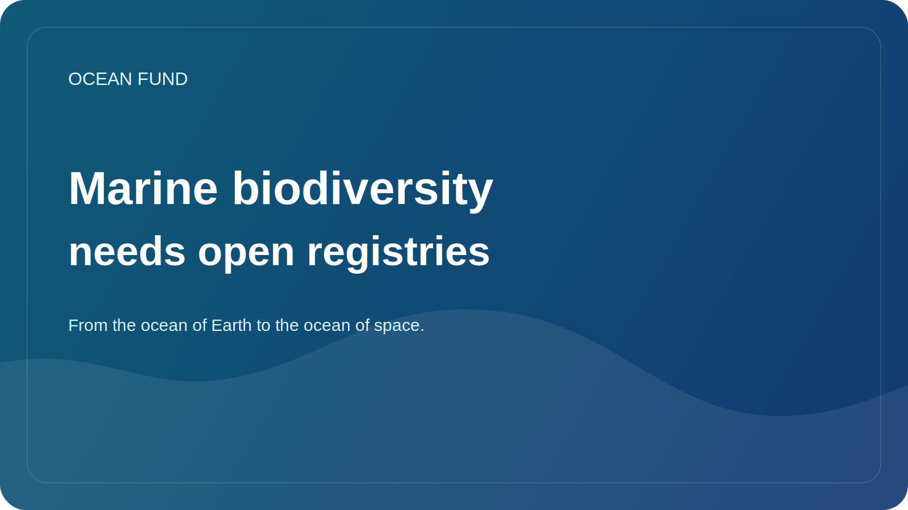

# Marine biodiversity needs open registries

Marine biodiversity is enormous, but not always clearly visible to the public. People may know about whales, corals, sharks or sea turtles, but the actual structure of life in the ocean is much broader and more complex. A huge number of organisms, ecosystems and relationships remain beyond the reach of mass perception.

This is why open registries, directories and biodiversity data systems are so important. They offer the opportunity not only to store data, but also to make ocean life visible in a more systemic sense. Through such systems it is possible to understand species distribution, taxonomic relationships, historical observations, gaps in knowledge and connections between different datasets.

For science, this is the basic infrastructure. But it is no less important for society. If a journalist, educator, museum curator, student or policy team cannot quickly find a reliable biodiversity reference point, then the conversation about conservation becomes weaker. It relies on isolated clear examples instead of systemic understanding.

Open registries also help combat the two extremes. On the one hand, they reduce chaos and duplication. On the other hand, they protect against the temptation to talk about ocean life in too general and non-operational terms. When there is a registry, atlas or linked data system, it becomes possible to speak more precisely.

For the Ocean Fund, this layer is important as part of the overall data and knowledge infrastructure. We want to connect science, education, public narrative and partner work. Without open biodiversity registries, this bridge will be incomplete. They allow you to create dataset cards, educational notebooks, event visuals, species explainers and public briefs, which are based not on random facts, but on a stable knowledge base.

Marine biodiversity not only needs protection, but also visibility. Public registries are one way to give this visibility form. This means that they are part of not only the data culture, but also the culture of oceanic responsibility.
