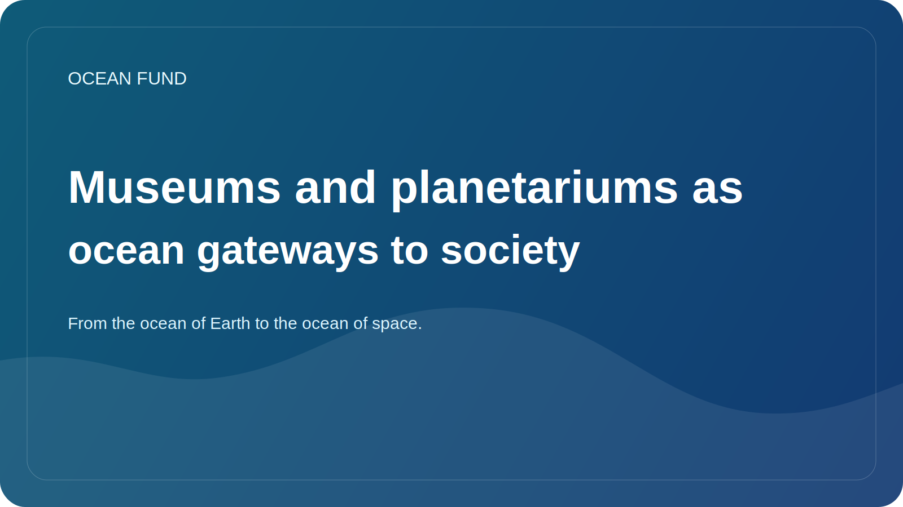

# Museums and planetariums as ocean gateways to society

The ocean theme should not live only in laboratories, reports and specialized data portals. For society to truly understand the role of the ocean, we need spaces where knowledge is made visible, emotionally accessible and intellectually coherent. This is why museums, science centers and planetariums are so important to the ocean agenda.

The museum knows how to do what dry documents rarely do: turn a complex system into a lived experience. Through an exhibit, map, model, video, interactive station, or lecture program, a person can see the ocean not as an abstract backdrop to the planet, but as a living environment connected to climate, biodiversity, data, and the future of the coasts.

Planetariums add another dimension to this. They naturally help build a bridge between the Earth's ocean and the cosmic perspective. Through satellite observations, Earth observation, ocean worlds and the theme of habitability, the planetarium can show that talking about the ocean is both a conversation about our planet and about the broader question of life in the Universe.

Such a bridge is especially valuable because it makes science broader and more interesting without losing rigor. Oceanology meets astrobiology. Marine data meets satellites. Climate theme meets long-horizon imagination. This is a very strong format for public science.

For the Ocean Fund, museums and planetariums are not just potential partners for “educational activities.” These are institutions capable of transforming public narrative into a sustainable cultural infrastructure. Through them you can launch lectures, exhibition modules, visualizations, educational kits, event formats and interdisciplinary bridges between the ocean, data and space.

If society wants to truly learn to see the ocean as the central system of life on Earth, it needs more than just papers and dashboards. It needs a cultural gateway of entry. And museums with planetariums are one of the strongest such gateways.
