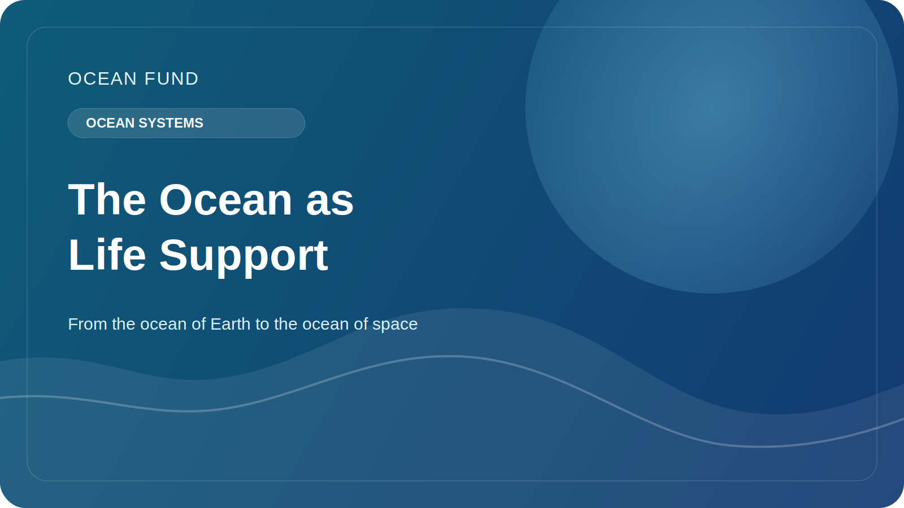

# The ocean as the Earth's life support system

When people talk about the ocean, they often think of water, coastlines, storms, fish, ships, or beautiful photographs of blue horizons. But the ocean is important not only as a landscape or a resource. It operates as one of the Earth's main life support systems.

The ocean helps regulate the planet's climate. It absorbs much of the excess heat that comes from rising greenhouse gases in the atmosphere. Without this buffer, climate change on land would be even sharper and more destructive. The ocean also participates in the global carbon cycle, sequestering carbon through physical, chemical and biological processes.

But the climate role of the ocean is not limited to numbers in scientific reports. Ocean conditions influence precipitation patterns, the severity of storms, the resilience of coastal ecosystems, and the quality of life in coastal regions. Through the atmosphere and currents, the ocean is connected to agriculture, food systems, urban infrastructure and the safety of millions of people.

The ocean is also a vast biological environment. Marine ecosystems support an enormous diversity of life, from plankton and corals to marine mammals and deep-sea organisms, which are still only partially understood. This biodiversity is not only important in itself. It is related to the stability of ecosystems, food chains, the state of coastal waters and nature's ability to respond to stress.

Of particular importance is that the ocean remains partially unknown. We know much more about it than we did a century ago, but we still haven't mapped the seabed at full resolution, described all the marine species, and don't fully understand how the ocean will change under the pressure of warming, acidification, deoxygenation, pollution and industrial use.

That is why the conversation about the ocean cannot be left only to specialists in narrow institutions. The ocean theme must be embedded in education, in public science, in data work, in culture and in international cooperation. We need not only research, but also clear forms of knowledge translation: maps, explanatory texts, visualizations, lectures, open data registers and socially useful platforms.

For the Ocean Fund, the ocean is important not as an abstract “blue theme,” but as the planet’s central living system. If society is to understand climate, sustainability, biodiversity and the future of coastal areas, it needs a clear language to talk about the ocean. That is why the ocean should not be considered as a background, but as one of the main objects of public knowledge of the 21st century.
