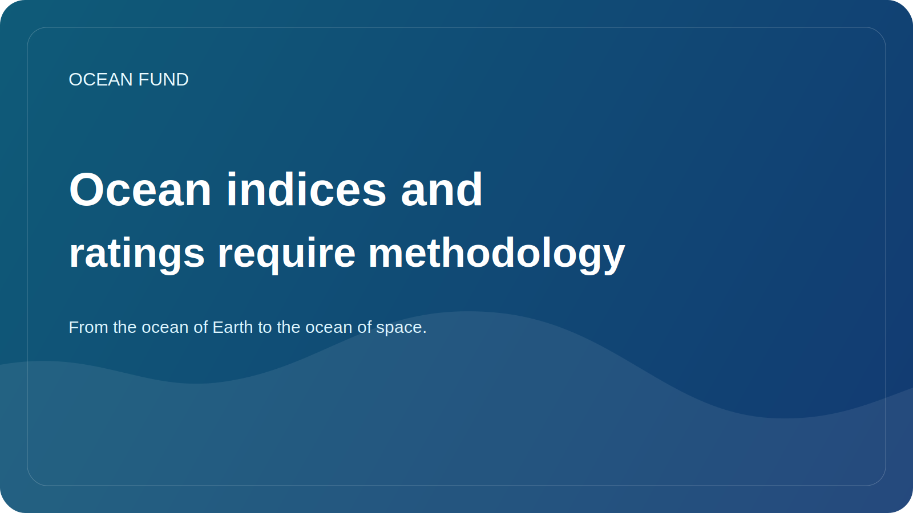

# Ocean indices and ratings require methodology

Indexes and ratings look very attractive. They promise quick comparisons, clear numbers, and a convenient way to talk about complex realities. In the ocean agenda, this is especially tempting: too many topics, too many actors, too many levels of uncertainty. I would like to have at least one simple indicator.

But this is where the risk comes in. The more complex the system, the more careful one must be in trying to reduce it to a single number or a convenient comparative scale. If an index does not explain what data is used, how weights are chosen, how gaps are accounted for, how uncertainties are interpreted, and what exactly is being measured, it becomes not a tool of knowledge but a tool of illusion.

Ocean indices can be very useful if they work honestly. They help to see patterns, notice differences between regions, build policy conversations and create a common language for organizations, donors, researchers and public projects. But only on condition that the index does not hide the methodology behind beautiful visualization.

For the Ocean Fund, this topic is especially important because we already have an internal and external index layer: site summaries, data maps, atlases, publication queues, task themes. This means that the project needs to create a culture of methodological transparency from the very beginning. If we call something an index, rating, register or atlas, we must clearly show the boundaries of such a tool.

A good index does not simplify reality to the point of vacuity. It helps you navigate while keeping you honest. A bad index gives the impression of precision where there is only a set of poorly comparable signals. The difference between them is the methodology.

Therefore, the conversation about oceanic indices should go not only in the plane of design and communication, but also in the plane of epistemic responsibility. A number without an explanation can be more dangerous than no number. And an index with transparent logic can become a powerful public tool for navigating a complex oceanic world.
