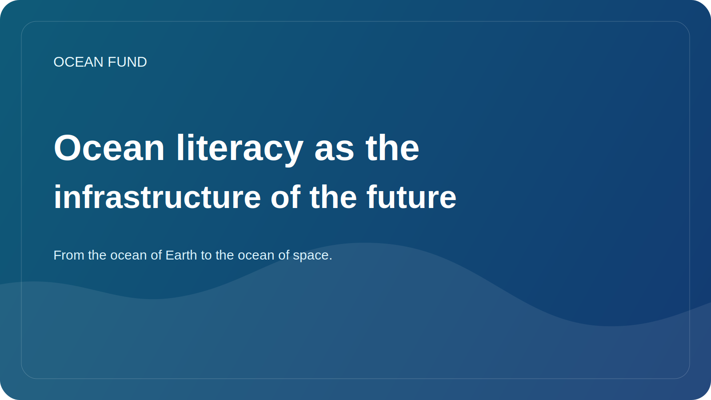

# Ocean literacy as the infrastructure of the future

Ocean literacy often sounds like something extra: a useful educational topic, a good format for a museum, a nice-to-have for school programs. But in reality, ocean literacy needs to be considered more broadly. This is not a decoration for the environmental agenda, but one of the infrastructures of the future.

If a society has a poor understanding of the role of the ocean, it will have a poorer understanding of climate, biodiversity, coastal risks, marine resources, global supply chains, and even the capabilities of science and technology. Oceanic illiteracy makes public conversation superficial. Decisions then become reactive rather than strategic.

True ocean literacy is not a collection of beautiful facts about whales and corals. It is the ability to see the ocean as a complex system, connected to life on land, to global climate, to data, to international politics, to food systems, and to imagining the future. It is also the ability to distinguish scientifically proven knowledge from simplifications and fashionable but weak claims.

In the 21st century, such literacy should rely not only on texts, but also on open data, maps, visualizations, citizen science, museum practices, GitHub repositories, public briefs, lectures and event materials. That is, we are no longer just talking about education, but about the connected public infrastructure of knowledge.

The Ocean Fund is built precisely on this logic. Not only research is important to us, but also forms of knowledge translation. We need not only dataset registers, but also clear login pages, one-pagers, event packs, mission statements and public-facing essays. All this is not “secondary packaging”, but part of how the ocean theme enters culture and decision-making.

Looking forward, ocean literacy will only become more important. The world will face new debates about the blue economy, coastal resilience, marine technology, deep-sea governance and the role of the ocean in climate adaptation. And the quality of decisions will depend on the extent to which society has a language for these conversations.

Therefore, ocean literacy should be understood as infrastructure. It is not as visible as a port, a satellite, or a laboratory, but without it knowledge flows poorly, partnerships weaken, and the public agenda becomes vulnerable to noise and manipulation. For the Ocean Fund, working on such infrastructure is one of its central tasks.
