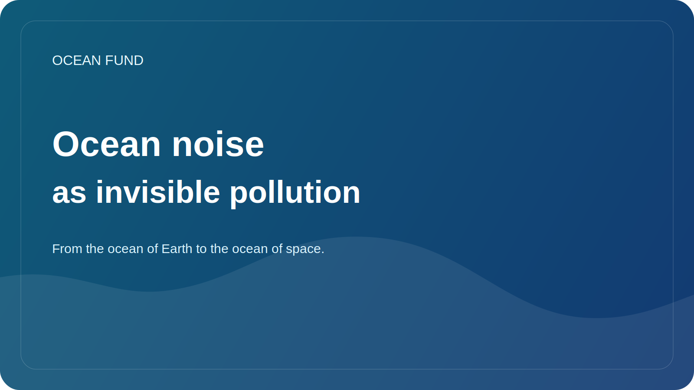

# Ocean noise as invisible pollution

When it comes to ocean pollution, people first think of plastic, oil, sewage, or chemicals. But there is another type of pollution near the ocean that is harder to see in photographs and therefore easier to underestimate. It's noise.

To humans, the ocean may seem like a large and silent environment, but for many marine organisms, sound is one of the most important channels for perceiving the world. Through sound, animals navigate, search for partners, communicate, find food and recognize danger. Therefore, the increase in anthropogenic noise changes not only the “background”, but the very conditions for the existence of marine life.

There are many sources of noise: shipping, construction, seismic surveys, military activity, industrial infrastructure. Their effects can range from short-term stress to long-term disturbances in behavior and migration. Particularly sensitive are species for which the acoustic environment plays a key role.

The problem of ocean noise is also important because it does not fit well with the usual ecological intuition. Plastic can be shown in your hands. An oil slick can be photographed. Acoustic pollution requires a different language: graphs, hydrophone datasets, explainers, shipping maps and patient scientific communication.

That is why the noise topic shows well why society needs open data and high-quality translation of science. Without them, the conversation easily devolves either into completely ignoring the problem or into harsh but poorly substantiated statements. Meanwhile, noise is a real ocean factor that requires monitoring, policy and public understanding.

For the Ocean Fund, the topic of ocean noise is interesting as an example of the “invisible ocean” - those processes that are important ecologically, but are hardly represented in the popular imagination. Working with such topics is especially valuable: they expand public understanding of the ocean and show that its vulnerability may not always look dramatic in the picture, but that does not make it any less serious.
