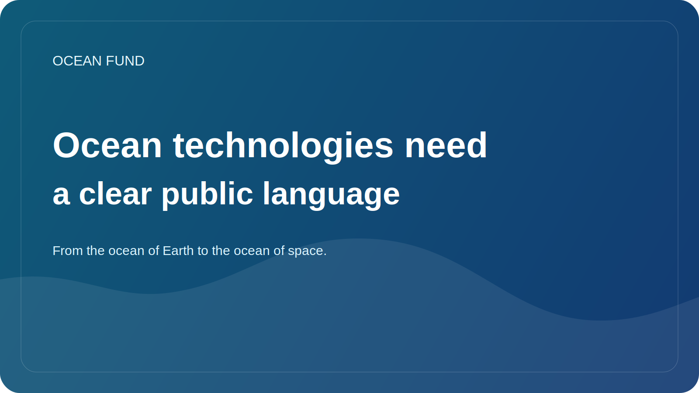

# Ocean technologies need a clear public language

Ocean technology is developing rapidly. Autonomous platforms, satellite services, underwater sensors, acoustic systems, bathymetric mapping, marine robotics, data platforms and new analytical tools are constantly expanding our ability to observe and work with the ocean. But public understanding of this layer lags behind.

Often the technology layer is presented either as something too narrow and engineering, or as an excuse for overly optimistic storytelling. In the first case, the topic remains closed to a wide audience. In the second, technologies turn into a set of promises not associated with restrictions, costs, risks and quality of evidence.

Clear public language is needed precisely to avoid both distortions. He should not simplify technologies to the point of meaninglessness, but he should not leave them within professional jargon. It is important for society to understand what the sensor measures, how the observation platform works, what data quality means, why calibration is needed and why do it at all.

This is important not only for education. Without such a language, it is difficult to build partnerships between engineers, museums, foundations, universities, event organizers and policy actors. Each of them hears the same technology differently. If there is no common translation layer, collaboration quickly stalls.

For the Ocean Fund, ocean technology is not a separate branch “for engineers”. It is part of the general public infrastructure of knowledge. We need a language that connects instrumentation, satellite observation, data analysis, education, exhibitions and ocean-to-space narrative. Only then does technology cease to be a black box and become part of an understandable public conversation.

The future of the ocean agenda largely depends on whether society can talk about technology without naive hype and without alienation. Creating such a language is already an independent work. And for projects like the Ocean Fund, it should be built into the very structure of public materials.
