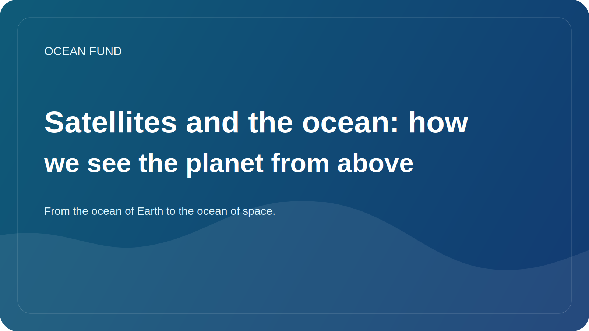

# Satellites and the ocean: how we see the planet from above

Modern understanding of the ocean is impossible without satellites. If previously many ideas about the marine environment were based on expeditions, buoys and coastal measurements, today observation of the Earth from space plays a huge role. It is this that gives us scale, comparability and the ability to see large spatial processes in almost real time.

Satellites make it possible to observe sea surface temperature, ocean color, ice distribution, surface height, large current patterns, turbidity, phytoplankton blooms and many other characteristics. This does not make traditional measurements unnecessary, but radically enhances them, allowing local observations to be linked to the global picture.

This connection is especially important for climate, coastal sustainability and educational work. When we see the ocean from above, it becomes clearer that it is not a static “blue mass”, but a dynamic system with fronts, eddies, seasonal cycles, biological surges and large climate patterns. Space observation changes the very scale of our perception of the ocean.

But here, too, caution is required. A satellite image is not a “direct photograph of the truth,” but the result of complex processing, models, calibration and interpretation. Therefore, public work with satellite data requires good sources, clear disclaimers, and clear explanations of limitations. Otherwise, a beautiful image may give rise to incorrect conclusions.

For the Ocean Fund, the satellite layer is especially important because it naturally links Earth's oceans to the oceans of space. We study the marine environment through instruments outside the atmosphere. This creates a powerful educational and intellectual bridge between oceanography, Earth observation, space missions and long-horizon exploration.

This is one of the strengths of the oceanic theme: it helps to talk about the Earth as a system that we understand better precisely when we are able to look at it both from the inside and from above. Satellites make this view possible. And the task of public platforms like the Ocean Fund is to translate it into a language that is understandable, neat and useful to society.
