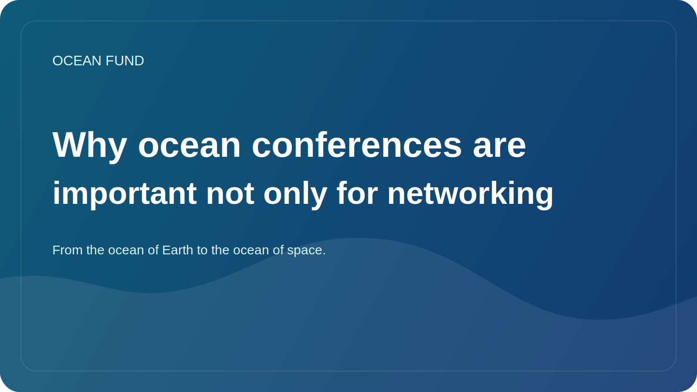

# Why ocean conferences are important not only for networking

Ocean conferences often appear to the outside observer to be a mixture of talks, panels, booths and business meetings. In this form, they can look like a ritual of a professional community. But in reality, good ocean events play a much more important role: they help connect research, policy, data, education, technology and public communication.

The oceanic agenda is too complex to live within a single discipline. Marine biologist, satellite analyst, museum curator, coastal planner, sensors developer, philanthropic funder and educational program organizer rarely work in the same daily circuit. Conferences and forums become places where these disparate languages ​​are at least temporarily united.

This is why high-quality event space is important not only for networking. It is needed for transfer between layers. The scientific result must meet with public communication. The data platform should meet with the educator or museum team. The policy discussion should hear ecosystem science, and technological optimism should hear limitations and risks.

For the Ocean Fund, this layer is especially important. The project is being built as an open infrastructure, not as a closed research group. This means that we need events not only as a place for self-presentation, but also as a field for reconnaissance, testing language, finding partners, comparing topics and turning ideas into concrete materials: briefs, one-pagers, dataset cards, workshops and public packages.

There is another reason to take oceanic events seriously. They shape how the ocean theme will be heard by society in the coming years. If the stage is dominated only by loud slogans, hype or vague promises, then the public agenda becomes weak. If the event is connected to data, methodology, ecosystem responsibility and good translation of science, it really moves the field forward.

Therefore, oceanic conferences, exhibitions and forums are not a secondary “communication” layer. It is part of the very infrastructure of oceanic knowledge. And the better we learn to use these spaces, the stronger the connection between the ocean, society and future solutions will become.
