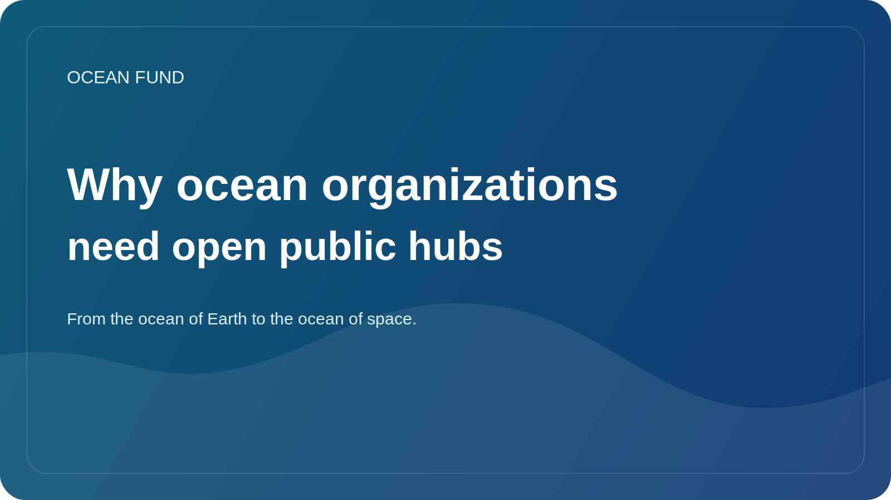

# Why ocean organizations need open public hubs

Many ocean organizations produce useful materials: studies, presentations, maps, policy briefs, event programmes, educational texts, letters, data sets and visualizations. But too often these materials live in disparate systems. Something is in the mail, something in cloud folders, something on the website, something in the team’s personal folders, and something disappears after the project is completed.

The problem here is not just inconvenience. Fragmentation weakens the very public presence of an organization. It becomes difficult for an outsider to understand what kind of project this is, what it stands for, how to enter it, what materials already exist and how to distinguish a draft from a public-ready output.

An open public hub solves this problem not through beautiful design, but through an architecture of clarity. It should collect the mission, research directions, data sources, event packs, one-pagers, governance notes, issue queue and participation routes in one place. Then the project ceases to depend on the memory of individual people and begins to work as a system.

This is especially important for the ocean agenda. There is too much intersection between science, data, education, technology and partnerships. If an organization does not have a stable public core, each new communication starts almost from scratch. The team spends energy repeating basic explanations instead of developing the field.

GitHub in this logic is interesting not only as a place for code. It can act as an open operational memory: a space where documents, articles, issues, discussions, data registers and partner-facing materials are interconnected. This approach enhances trust because it shows the structure, status of materials and direction of movement.

For the Ocean Fund, an open hub is not a side tool, but one of the main forms of existence of the project. If an oceanic organization wants to be understandable, verifiable and collaboration-ready, it needs not just a website and not just a folder of files, but a living public system. This is what makes an open hub a strategic asset rather than a technical detail.
