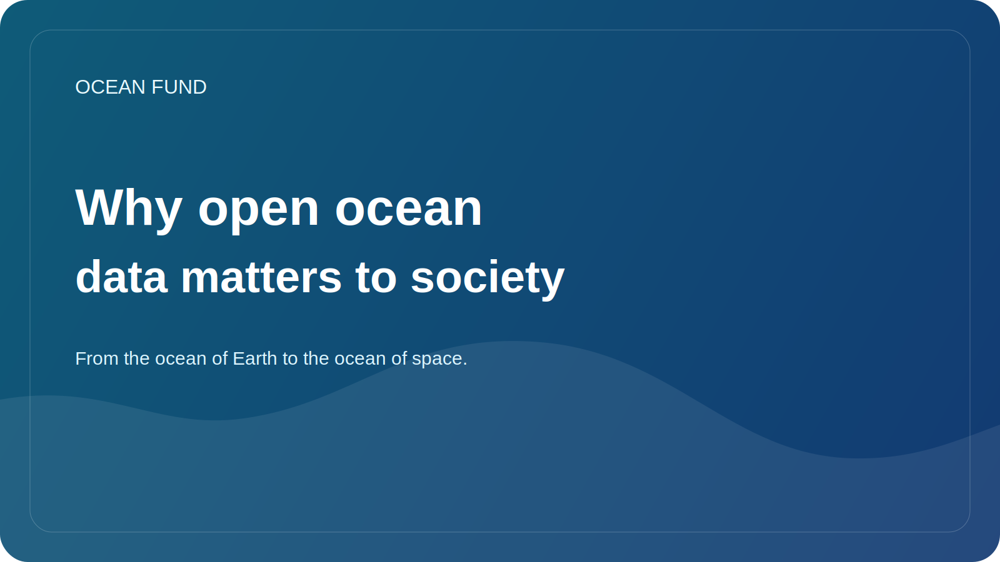

# Why open ocean data matters to society

Today, talking about the ocean is impossible without data. Sea surface temperature, salinity, bathymetry, satellite observations, species distributions, coral health, sea ice, pollution and coastal risks are increasingly being described not only in words but also in measurements. However, data alone does not create public benefit.

Open ocean data is important because it allows different groups to work on the same reality. A researcher sees scientific material, a teacher gets the basis for a lesson, a museum can make a visual story, a journalist can check a claim, and a developer can build a tool or map. When access to data is open, the ocean agenda ceases to be a closed professional club.

But openness does not equal automatic understandability. Even good data often remains difficult to use externally. A set may have a complex license, unobvious restrictions, a technical format that is incomprehensible to a non-specialist, or metadata that requires separate translation into human language. So between “the data exists” and “society can use it” lies a lot of interpretation work.

This is where dataset cards, source registers, glossaries, notebooks, demo cards and neat public-facing briefs are especially important. They do not replace science, but create a bridge between a specialist and an external audience. Such a bridge is needed not only for education. It is also needed for a more responsible conversation about risks, infrastructure, climate, coastal policy and conservation.

Open data also reduces the reliance on fancy but empty claims. If a project talks about the ocean, ocean protection, monitoring, or the blue economy, there must be a way to check what the wording is based on. Having an open source, date of access, description of restrictions and verification status makes public speech stronger and more honest.

For the Ocean Fund, open ocean data is more than just a technical resource. This is the basis for public trust, educational work and international cooperation. Through open data you can build maps, lectures, briefs, event materials, partnership proposals and research questions. They help connect ocean science to society without losing rigor.

In the future, the importance of this layer will only grow. As more satellite missions, sensor networks, undersea platforms, and global observation programs become available, the infrastructure that keeps us from drowning in the deluge of information will become more important. Society needs not just data portals, but clear navigation systems based on ocean data. The creation of such systems is no longer a secondary task, but part of modern oceanic culture.
