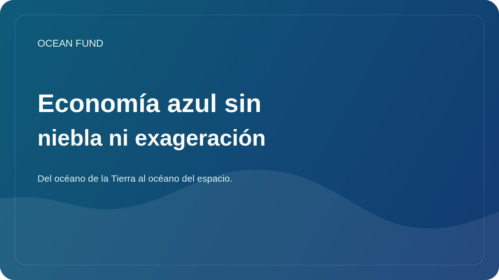

# Economía azul sin niebla ni exageración

El término “economía azul” se ha vuelto muy popular. Lo utilizan gobiernos, inversores, empresas de tecnología, ONG, organizaciones internacionales y organizadores de foros. Pero cuanto más se utilice este lenguaje, mayor será el riesgo de que se convierta en un hermoso caparazón que oculte prácticas demasiado diferentes y a veces contradictorias.

En un sentido estricto, una economía azul debería significar trabajar con el océano de manera que conecte la actividad económica con la conservación de los ecosistemas, el rigor científico, la sostenibilidad a largo plazo y la distribución justa de los beneficios. Esto puede incluir pesca sostenible, acuicultura, servicios de datos marinos, monitoreo, adaptación costera, tecnologías verdes, educación y mecanismos financieros que no destruyan la base misma de la vida oceánica.

Pero en la práctica, a veces hay intentos de incluir casi cualquier actividad marítima en la economía azul, incluso si sus consecuencias ambientales y sociales no se comprenden bien. Por eso es importante que Ocean Fund trabaje con este tema sin exageraciones. Lo que se necesita no son eslóganes generales, sino preguntas claras: ¿qué datos respaldan los beneficios declarados? ¿Cómo se tienen en cuenta los riesgos? ¿quién gana? ¿quién corre con los costos? ¿Cómo se mide el resultado?

Este enfoque es útil tanto para las asociaciones como para las comunicaciones públicas. Ayuda a separar la sostenibilidad real de las exageraciones del marketing. En el espacio oceánico, esto es especialmente importante porque muchas soluciones parecen innovadoras y hermosas, pero sus efectos a largo plazo pueden ser ambiguos o no estar suficientemente probados.

Un lenguaje saludable para una economía azul debe incluir limitaciones, no sólo oportunidades. Debe reconocer que el océano no es una reserva inagotable de recursos, sino un sistema vivo complejo. Y si la economía quiere seguir siendo verdaderamente “azul”, tendrá que aprender a trabajar no contra esta complejidad, sino dentro de ella.

Para Ocean Fund, el tema de la economía azul no es una manera de añadir una palabra de moda al discurso público. Esta es una oportunidad para entablar una conversación más precisa sobre el futuro del océano, que incluye tecnología, datos, finanzas y responsabilidad del ecosistema. Sin tal conexión, el concepto pierde rápidamente su significado. Con ello, puede convertirse en uno de los marcos importantes del siglo XXI.
