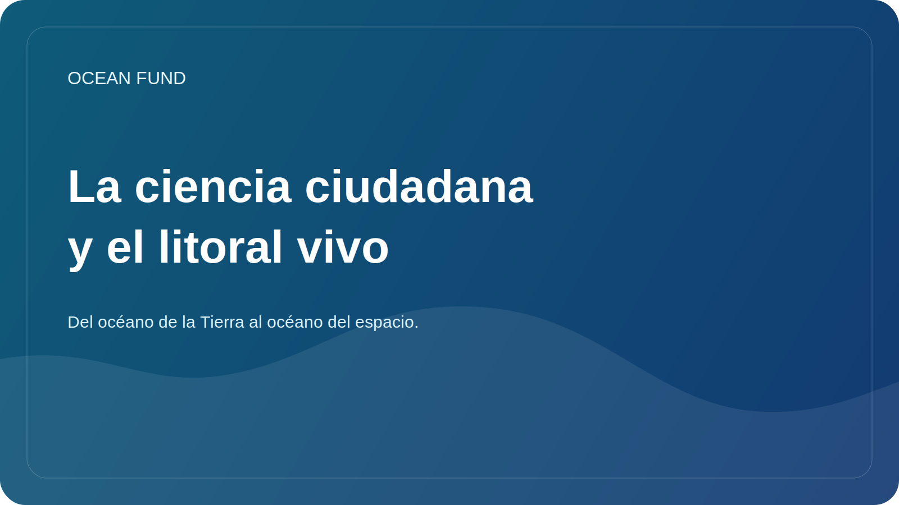

# La ciencia ciudadana y el litoral vivo

La costa aparece a menudo como un límite evidente entre la tierra y el mar. Pero, de hecho, es una de las zonas más vibrantes, sensibles y que cambian rápidamente del planeta. Aquí es donde convergen los procesos naturales, la infraestructura, el turismo, la ecología, la economía local y la vida cotidiana de las comunidades. Por eso la costa es tan importante para la ciencia ciudadana.

La ciencia ciudadana es útil no cuando reemplaza a la ciencia, sino cuando amplía la capacidad de observación de la sociedad. Las observaciones voluntarias, las grabaciones fotográficas, los protocolos sobre basura, la erosión costera, los avistamientos de biodiversidad o los indicadores de calidad pueden crear una capa importante de datos, especialmente si se combinan con una metodología clara y respeto por las limitaciones.

Lo bueno del tema de la costa viva es que trae a casa la agenda oceánica. Es más fácil para una persona ver cambios en la playa, las algas, la basura, la infraestructura costera o las fluctuaciones estacionales del agua que el sistema abstracto del clima oceánico en su conjunto. A través de la observación local, la sociedad logra entrar en la conversación oceánica más amplia.

Pero la ciencia ciudadana requiere cautela. No toda la recopilación de datos es útil. Necesitamos protocolos claros, entender qué se mide exactamente, cómo se almacena la información, qué sesgos existen y qué no se puede hacer con datos personales o sensibles. Sin esta disciplina, la iniciativa puede convertirse fácilmente en ruido.

Para Ocean Fund, la ciencia ciudadana es interesante como puente entre la participación pública y la cultura de los datos. Esto no es sólo una “actividad voluntaria”, sino una oportunidad para construir una infraestructura pública de cuidado del océano. A través de él puedes conectar escuelas, ONG, museos, comunidades costeras y prácticas de datos abiertos.

Una costa viva es una buena imagen para este trabajo. Está en constante cambio, respondiendo al clima, la actividad económica y los procesos ecosistémicos. Y si la sociedad aprende a observar más de cerca esta frontera viva, comienza a comprender mejor tanto el océano como su propio papel junto a él.
