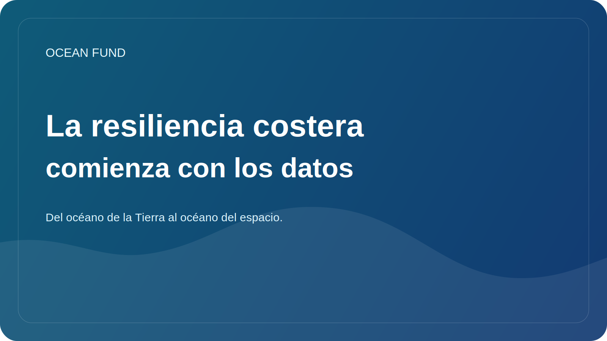

# La resiliencia costera comienza con los datos

Cuando la gente habla de resiliencia costera, normalmente piensa en tormentas, erosión, aumento del nivel del mar, infraestructura y riesgos para las ciudades. Pero la resiliencia costera no comienza con estructuras concretas o titulares alarmantes. Comienza con qué tan bien vemos y entendemos lo que está sucediendo.

Las costas son zonas de gran dinámica. Aquí se encuentran la tierra, el mar, los procesos atmosféricos, los sistemas fluviales, el transporte, el turismo, la ecología y la vida urbana. Incluso pequeños cambios en los patrones de olas, precipitaciones, transporte de sedimentos, temperatura del agua o patrones de desarrollo pueden cambiar gradualmente la estabilidad de todo un sistema costero.

Sin datos, esta complejidad rápidamente se convierte en un caos de interpretaciones. Algunos sólo ven el clima, otros sólo la infraestructura, otros sólo la contaminación local. Pero una solución sostenible requiere combinar múltiples capas: observaciones satelitales, batimetría, mediciones costeras, series temporales históricas, mapas de uso de la tierra, observaciones biológicas y conocimiento local de las comunidades.

No son sólo las autoridades y los investigadores los que necesitan buenos datos costeros. También son importantes para la participación pública. Si la gente tiene mapas claros, series temporales, visualizaciones de cambios y materiales explicativos claros, la conversación sobre la costa se vuelve menos abstracta. Hay espacio para decisiones razonables y no sólo para una reacción emocional ante la próxima emergencia.

Las herramientas abiertas y reproducibles son especialmente importantes aquí. La resiliencia costera se beneficia de mapas, tarjetas de conjuntos de datos, protocolos de observación, ciencia ciudadana y resúmenes de datos públicos. Hacen que el tema sea más accesible para escuelas, museos, organizaciones locales, periodistas y lugares para eventos.

Para Ocean Fund, las costas son el lugar donde el tema del océano se encuentra directamente con la vida de la sociedad. Aquí se ve claramente que los datos no son un lujo técnico, sino parte de la infraestructura civil y medioambiental. Si queremos hablar seriamente de resiliencia, también debemos hablar de accesibilidad, calidad y traducción de los datos en soluciones públicas comprensibles.
