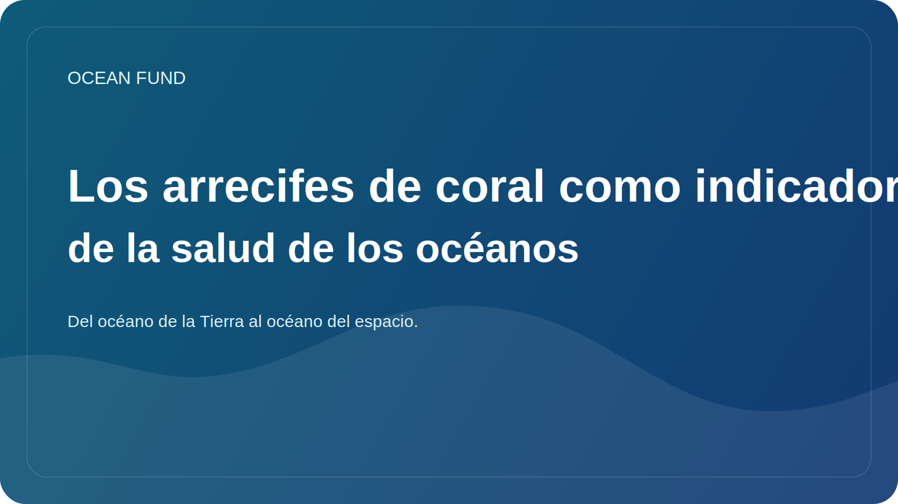

# Los arrecifes de coral como indicador de la salud de los océanos

Los arrecifes de coral a menudo se perciben como hermosos exóticos, dignos de postales, películas y folletos de viajes. Pero en un sentido científico y social, los arrecifes son mucho más importantes. Actúan como un indicador sensible de las condiciones del océano y una de las señales más claras de la rapidez con la que está cambiando el medio marino.

Los arrecifes son extremadamente ricos en vida. En un área relativamente pequeña, sustentan una enorme diversidad de organismos: peces, invertebrados, algas, comunidades microbianas y una variedad de formas de vida interconectadas. Por lo tanto, la degradación de los arrecifes significa no sólo la pérdida de un paisaje particular, sino también la destrucción de una compleja arquitectura ecosistémica.

Es especialmente importante que los arrecifes sean muy sensibles al sobrecalentamiento del agua. Las olas de calor marinas, los cambios en la química de los océanos, la contaminación local, las perturbaciones mecánicas y el uso costero insostenible afectan rápidamente la salud de los corales. Cuando vemos blanqueamiento o debilitamiento masivo de los arrecifes, no es un “problema” local sino parte de un patrón más amplio de estrés oceánico.

Al mismo tiempo, los arrecifes no sólo tienen un significado natural, sino también social. Se relacionan con la pesca, el turismo, la protección costera y la resiliencia de las comunidades locales. Para muchas regiones, el arrecife es al mismo tiempo un entorno de vida, una fuente de ingresos, una realidad cultural y una barrera natural que amortigua los efectos de las olas y las tormentas.

Hablar de arrecifes también es útil porque aclara el tema del océano para una audiencia más amplia. Los arrecifes pueden explicar el clima, la biodiversidad, la acidez de los océanos, las áreas marinas protegidas, las observaciones satelitales y la necesidad de un seguimiento a largo plazo. Este es uno de esos temas en los que la precisión científica y la comunicación pública pueden reforzarse mutuamente.

Para el Ocean Fund, el tema de los corales es importante como parte de una cuestión más amplia: cómo traducir los complejos cambios oceánicos a un lenguaje que sea comprensible para el público sin perder el rigor científico. Los arrecifes proporcionan un poderoso punto de entrada a esta conversación porque son a la vez hermosos, vulnerables, reveladores y profundamente conectados con el futuro del océano.
