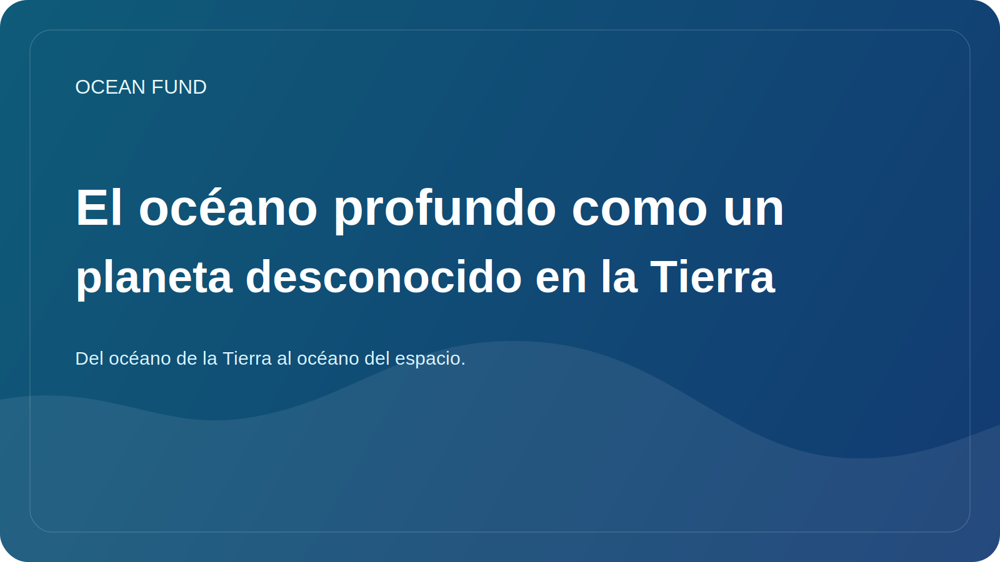

# El océano profundo como un planeta desconocido en la Tierra

Se acostumbra hablar de las profundidades del océano como algo remoto, oscuro y casi inaccesible. Hay algo de verdad en esto, pero también hay una fórmula más precisa: las profundidades del océano son uno de los entornos inexplorados más grandes de nuestro propio planeta.

A grandes profundidades, la presión, la temperatura, la luz y la disponibilidad de energía cambian. Hay ecosistemas adaptados a condiciones que durante mucho tiempo parecieron casi incompatibles con la vida activa. Los respiraderos hidrotermales, las llanuras de aguas profundas, los montes submarinos y las zonas de fractura muestran cuán limitada puede ser nuestra visión intuitiva de la habitabilidad.

Por eso las profundidades del océano son tan importantes no sólo para la oceanografía, sino también para la ciencia en general. Ayuda a plantear preguntas sobre los orígenes y los límites de la vida, los ciclos biogeoquímicos, el papel de los ecosistemas poco comprendidos en la resiliencia de los océanos y cómo debería comportarse la humanidad en un entorno que todavía sólo comprende de forma fragmentaria.

Hoy en día, las profundidades del océano están cada vez más en el centro de los debates económicos y políticos. Existe un interés creciente en la minería submarina, la cartografía de los fondos marinos, las aplicaciones militares e industriales, los nuevos sistemas autónomos y la ampliación de la infraestructura de observación. Pero es en este momento cuando resulta especialmente importante no sustituir el conocimiento por la pasión tecnológica.

Las profundidades del océano requieren la disciplina de la incertidumbre. Necesitamos reconocer que el mapa está incompleto, los ecosistemas están sólo parcialmente descritos y los efectos de las intervenciones pueden ser lentos y no obvios. En este sentido, el tema de las profundidades marinas también es útil para el pensamiento social: recuerda que el progreso no debería significar la explotación automática de cualquier entorno disponible.

Para Ocean Fund, las profundidades del océano son importantes como puente intelectual entre la exploración de la Tierra y la imaginación de otros mundos. Si no entendemos completamente nuestras propias profundidades, entonces vale la pena estar atentos a las historias sobre los océanos subglaciales de Europa o Encelado. Las profundidades del océano de la Tierra son a la vez una frontera científica y una escuela de modestia epistémica.
