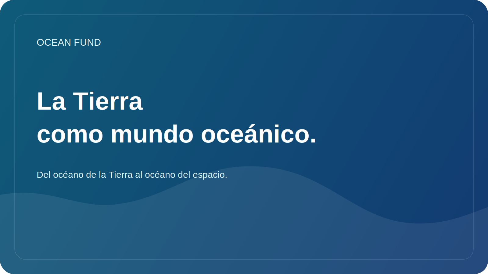

# La Tierra como mundo oceánico.

La idea de “mundos oceánicos” suele asociarse con el espacio. Europa, Encelado, Titán y otros objetos del sistema solar son de interés para los científicos porque pueden existir enormes volúmenes de agua bajo sus caparazones helados o en entornos complejos. A través de este tema, la ciencia plantea una de las preguntas más profundas: ¿dónde más son posibles las condiciones para la vida?

Pero para comprender verdaderamente los mundos oceánicos, es útil mirar primero a la Tierra como un mundo oceánico. En nuestro planeta, el océano cubre la mayor parte de la superficie, regula el clima, conecta continentes, da forma a los ciclos globales de materia y energía y crea las condiciones para una asombrosa diversidad de vida. La Tierra no es sólo un “planeta con océano”. En muchos sentidos es un planeta oceánico.

Esta perspectiva cambia tanto la conversación educativa como la científica. Cuando miramos la Tierra como un mundo oceánico, la oceanografía deja de ser sólo una disciplina regional sobre costas, corrientes y profundidades. Se convierte en parte de una pregunta mucho más amplia sobre cómo el agua, la energía, la química, la geología y la biología se unen para formar un sistema que pueda sustentar la vida.

Aquí cobra especial importancia el puente entre la oceanología y las observaciones espaciales. Los satélites nos ayudan a ver la temperatura, el color del océano, el hielo, la altura de la superficie del mar, los grandes patrones de circulación y los cambios costeros. Al mismo tiempo, la investigación sobre lunas heladas, océanos subglaciales y astrobiología está trayendo nuevas preguntas a la Tierra. ¿Qué entornos extremos de nuestro planeta pueden servir como análogos? ¿Qué nos enseñan las profundidades del océano sobre la vida en la oscuridad, bajo presión y en sistemas con limitaciones energéticas? ¿Cómo puede la sociedad comprender mejor el océano si lo ve como el hogar de la vida y como un modelo científico para otros mundos?

Para el Ocean Fund, la fórmula “del océano de la Tierra al océano del espacio” es importante por este motivo. No aleja la conversación de la Tierra, al contrario, la fortalece. Ayuda a mostrar que el tema de los océanos no tiene que ver sólo con la ecología y el clima, sino también con la imaginación, la exploración, la tecnología de observación y la comprensión a largo plazo de la habitabilidad.

Este lenguaje es especialmente útil para museos, planetarios, festivales científicos, programas educativos y eventos interdisciplinarios. Conecta el océano, los datos, los satélites, la biología, el clima y el espacio en una historia comprensible. Y si esta historia se cuenta con cuidado, sin sensacionalismo y sin niebla pseudocientífica, puede ser una manera poderosa de involucrar a nuevas personas en la agenda oceánica.

La Tierra ya nos da acceso al mundo oceánico en el que vivimos. Comprenderlo más profundamente es comprender mejor simultáneamente nuestro propio planeta y los horizontes para futuras exploraciones más allá de él.
