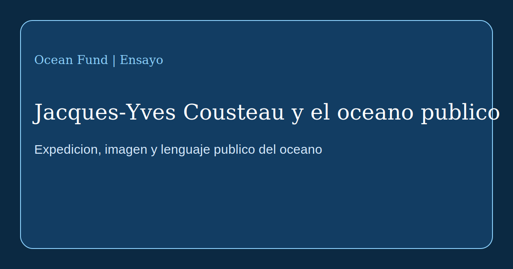

# Jacques-Yves Cousteau y el oceano publico

Jacques-Yves Cousteau importa no solo como explorador del mar, inventor o cineasta. Importa como una de las figuras que ayudaron a trasladar el oceano desde un dominio profesional cerrado hacia la imaginacion publica masiva. Antes de Cousteau, para muchas personas el oceano era un telon romantico o una zona de practica militar, pesquera y cientifica. Despues de Cousteau, tambien se convirtio en un escenario publico de conocimiento, alerta, belleza y responsabilidad.

La historia oficial de la [Cousteau Society](https://www.cousteau.org/know/vessels/calypso/) muestra que el Calypso no era solo un barco. Era un laboratorio flotante, un estudio de filmacion, una base de expedicion y una plataforma de invencion. A traves de el, Cousteau unio travesia, imagen, tecnologia y relato. Esa combinacion fue una de sus mayores contribuciones. No solo buceaba e investigaba. Construia un lenguaje mediante el cual la sociedad podia ver el mundo submarino como parte de su propio futuro.

Ese lenguaje se formaba con varias capas. Primero, la tecnologia: equipos de buceo autonomo, camaras submarinas, sumergibles como la famosa [Diving Saucer](https://www.cousteau.org/know/inventions/diving-saucer/), camaras de observacion, el turbosail y nuevas formas de movilidad oceanica. Segundo, la ruta: el Mediterraneo, el mar Rojo, el Amazonas, la Antartida, el golfo Persico, el mar de Cortes, atolones e islas remotas. Tercero, la dramaturgia: Cousteau convertia la expedicion en una historia publica.

Segun la Cousteau Society, en 1977 el equipo del Calypso realizo un estudio sobre la contaminacion del Mediterraneo en 13 paises, y en 1985 lanzo una expedicion alrededor del mundo a bordo del Calypso y del Alcyone. Estos proyectos importan no solo como episodios de la historia cientifica. Muestran que una expedicion puede ser investigacion, diplomacia, produccion mediática y advertencia ecologica al mismo tiempo.

Para Ocean Fund, la leccion es directa. No basta con recopilar datos, redactar documentos internos o enumerar problemas del oceano. Hace falta traduccion publica: ensayos, mapas, textos expositivos, rutas escolares, conferencias, historias visuales, paginas para socios y materiales multilingues que hagan el oceano legible y cercano. Cousteau no sustituye a la ciencia contemporanea, pero recuerda que entre la investigacion y la sociedad siempre debe haber un medio.

Tambien es importante estudiar a Cousteau no como un icono sin fallos, sino como un modelo de mediacion oceanica publica. Hoy tenemos otros estandares eticos, otras capacidades tecnicas y otra escala de amenaza ecologica. Pero la tarea sigue siendo la misma: hacer del oceano no una abstraccion, sino una parte visible del pensamiento colectivo.

Si Ocean Fund quiere avanzar con la formula «Del oceano de la Tierra al oceano del espacio», necesita este nivel de lenguaje publico: no solo precision cientifica, sino tambien la capacidad de construir imagenes, rutas de atencion y un vinculo duradero entre las personas, las expediciones y el agua planetaria.
