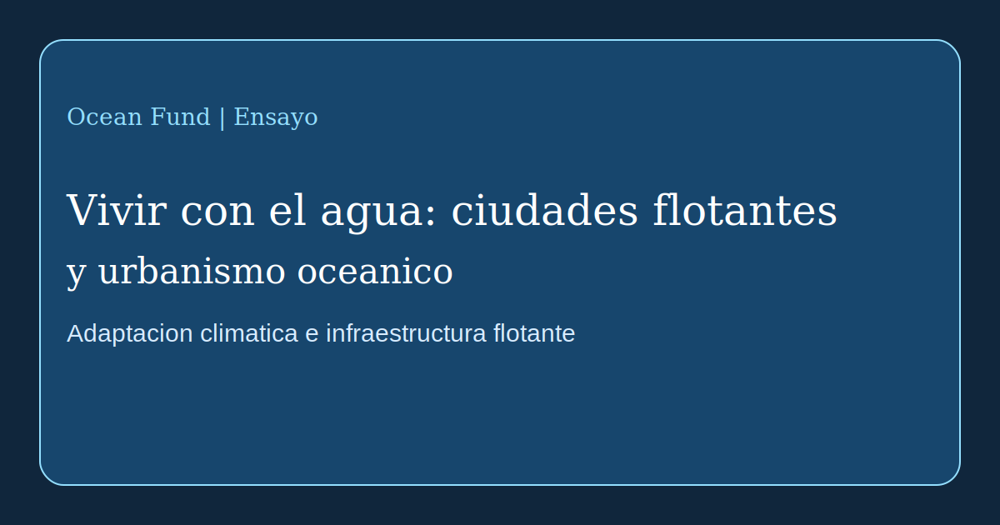

# Vivir con el agua: ciudades flotantes y urbanismo oceanico

El tema de las ciudades sobre el agua hace tiempo dejo de ser pura ciencia ficcion, pero sigue estando en el limite entre experimento, ingenieria, adaptacion climatica e imaginacion politica. Por eso debe abordarse sin niebla entusiasta y sin escepticismo automatico. La infraestructura flotante ya existe en varias formas. La verdadera pregunta ya no es si construir sobre el agua es posible, sino que proposito publico tienen estos sistemas y a quien benefician realmente.

En un extremo de este campo estan los proyectos de adaptacion climatica y urbana. [UN-Habitat](https://unhabitat.org/news/27-apr-2022/un-habitat-and-partners-unveil-oceanix-busan-the-worlds-first-prototype-floating), junto con sus socios, presento OCEANIX Busan como un prototipo de expansion urbana flotante sostenible para ciudades costeras afectadas por el aumento del nivel del mar, la escasez de suelo y el riesgo climatico. La logica aqui no es huir de la tierra, sino buscar nuevas formas de desarrollo costero.

En el otro extremo estan las lineas mas radicales vinculadas con la autonomia, las comunidades marinas y la cultura seasteading. [The Seasteading Institute](https://www.seasteading.org/about/) describe de manera directa las comunidades flotantes como espacios para la experimentacion social, mientras que sus [active projects](https://www.seasteading.org/active-projects/) muestran un abanico mas amplio: maricultura, rompeolas, plataformas residenciales e infraestructura productiva sobre el mar. En paralelo, empresas como [Ocean Builders](https://oceanbuilders.com/about-us/) traducen el tema hacia el diseno de producto, la vivienda modular y la vida sobre las olas.

Entre esos polos existe una tercera linea: la arquitectura adaptativa sobre el agua. Practicas como [Waterstudio](https://www.waterstudio.nl/built-on-water-floating-houses/) entienden la construccion flotante no como una utopia separada, sino como una extension de la planificacion urbana bajo condiciones hídricas cambiantes. Esta logica esta mas cerca no de “una nueva civilizacion en mar abierto”, sino del rediseño gradual de las relaciones entre ciudad, frente de agua, infraestructura y riesgo de inundacion.

Para Ocean Fund es importante mantener varias preguntas a la vez. Quien va a vivir sobre el agua? Para que se construye exactamente el sistema flotante: lujo, adaptacion climatica, investigacion, turismo, maricultura, vivienda temporal o experimentacion publica? Como se resuelven los residuos, la energia, el agua dulce, el mantenimiento, la accesibilidad, la seguridad y el regimen legal? Y como cambian estas respuestas entre aguas ecuatoriales, templadas y frias?

Por eso el seasteading y las ciudades flotantes merecen no consignas, sino una capa seria de investigacion. En algunos casos pueden convertirse en herramientas utiles para la resiliencia costera y nuevos tipos de infraestructura oceanica. En otros pueden acabar siendo escaparates costosos con poca relacion con el bien publico. Entre esos extremos esta el trabajo real: comparar modelos, seguir casos y evaluar consecuencias tecnicas, ecologicas y sociales.

Para Ocean Fund este tema importa no como una curiosidad exotica, sino como parte de una linea mayor: aprender a vivir con el agua. Si el siglo XXI se convierte en un siglo de presion climatica sobre las costas, entonces el lenguaje del urbanismo oceanico sera necesario no solo para arquitectos e inversores, sino tambien para investigadores, periodistas, museos, ciudades y plataformas de interes publico. Hablar del futuro del oceano tambien es hablar de futuras formas de vida sobre el agua.
