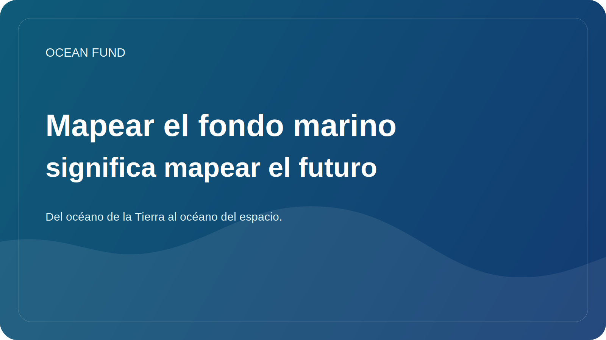

# Mapear el fondo marino significa mapear el futuro

En tierra, estamos acostumbrados a pensar en un mapa como algo básico. Los mapas de ciudades, carreteras, ríos, fronteras y terrenos parecen casi evidentes. Pero cuando se trata del océano, especialmente del fondo marino, el panorama cambia. Una parte importante del relieve submarino aún no se conoce con tanto detalle como quisieran la ciencia y la sociedad modernas.

Este no es sólo un problema técnico de la cartografía. El fondo marino es importante para comprender la geología, los ecosistemas, la circulación, las rutas de cables e infraestructura, los riesgos asociados con deslizamientos de tierra y tsunamis, y el futuro de las soluciones en aguas profundas. Sin buenos mapas batimétricos es difícil hablar de política marina a largo plazo y de trabajo responsable con el océano.

Además, mapear el fondo es importante simbólicamente. Nos recuerda que en nuestro propio planeta queda una enorme capa de espacio que aún no es visible con suficiente claridad. En la era de los satélites y las plataformas digitales, es fácil olvidar que gran parte del mundo físico aún no se describe completamente.

Para el Ocean Fund, el tema del fondo marino es importante tanto desde el punto de vista científico como cultural. Nos permite hablar del océano como una frontera no sólo en un sentido romántico, sino también en un sentido práctico: una frontera de datos, observaciones, infraestructura y conocimiento. A través de la batimetría conviene conectar ciencia, tecnología, visualización e imaginación pública.

Hay otro aspecto importante. Cuando mapeamos el fondo marino, en realidad estamos mapeando el espacio de soluciones futuras. ¿Qué zonas son vulnerables? ¿Dónde están los ecosistemas importantes? ¿Dónde es todavía demasiado débil nuestro conocimiento? ¿Dónde puede ayudar la tecnología y dónde se necesita más precaución? El mapa se convierte no sólo en una imagen, sino en una base para pensar.

Por lo tanto, trabajar en el fondo marino no es una cuestión exclusiva de especialistas limitados. También es importante que la sociedad comprenda por qué el fondo del océano no es un “espacio vacío bajo el agua”. Esta es una de las grandes estructuras de nuestro planeta. Y cuanto mejor lo veamos, más responsables podremos hablar sobre el futuro del océano.
