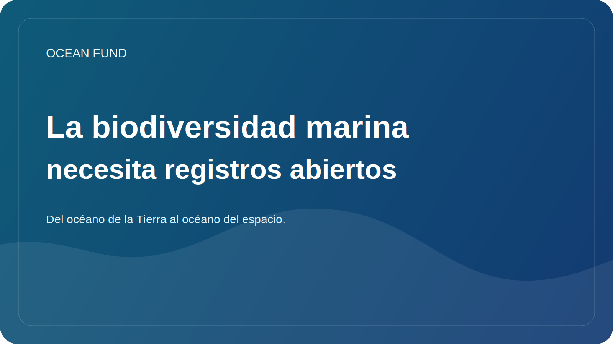

# La biodiversidad marina necesita registros abiertos

La biodiversidad marina es enorme, pero no siempre es claramente visible para el público. Puede que la gente conozca las ballenas, los corales, los tiburones o las tortugas marinas, pero la estructura real de la vida en el océano es mucho más amplia y compleja. Una gran cantidad de organismos, ecosistemas y relaciones permanecen fuera del alcance de la percepción masiva.

Por eso son tan importantes los registros, directorios y sistemas de datos sobre biodiversidad abiertos. Ofrecen la oportunidad no sólo de almacenar datos, sino también de hacer visible la vida oceánica en un sentido más sistémico. A través de tales sistemas es posible comprender la distribución de especies, las relaciones taxonómicas, las observaciones históricas, las lagunas en el conocimiento y las conexiones entre diferentes conjuntos de datos.

Para la ciencia, esta es la infraestructura básica. Pero no es menos importante para la sociedad. Si un periodista, educador, curador de museo, estudiante o equipo político no puede encontrar rápidamente un punto de referencia confiable sobre la biodiversidad, entonces la conversación sobre la conservación se debilita. Se basa en ejemplos claros y aislados en lugar de una comprensión sistémica.

Los registros abiertos también ayudan a combatir los dos extremos. Por un lado, reducen el caos y la duplicación. Por otro lado, protegen contra la tentación de hablar de la vida oceánica en términos demasiado generales y no operativos. Cuando existe un registro, un atlas o un sistema de datos vinculados, se puede hablar con mayor precisión.

Para el Fondo Oceánico, esta capa es importante como parte de la infraestructura general de datos y conocimientos. Queremos conectar la ciencia, la educación, la narrativa pública y el trabajo en conjunto. Sin registros abiertos de biodiversidad, este puente estará incompleto. Le permiten crear tarjetas de conjuntos de datos, cuadernos educativos, imágenes de eventos, explicaciones de especies e informes públicos, que no se basan en hechos aleatorios, sino en una base de conocimiento estable.

La biodiversidad marina no sólo necesita protección, sino también visibilidad. Los registros públicos son una forma de dar esta forma de visibilidad. Esto significa que son parte no sólo de la cultura de los datos, sino también de la cultura de la responsabilidad oceánica.
